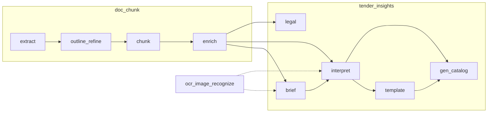

# Agent Requirements — 大模型智能体规格说明书

> 版本：2026-07-06  
> 目的：梳理 tender_skills 项目中全部大模型调用点，为「业务流程 ↔ 智能体」解耦提供可执行的 agent 规格。  
> 粒度：**1 call_type = 1 独立智能体**（共 16 个）。  
> 运行时：全部 call_type 已通过 `AgentClient.invoke(call_type, input)` 统一调用（`src/agent_platform/`；详见 §7）。

---

## 1. 概述

### 1.1 项目定位

tender_skills 是招标文档处理流水线，分为三大 Python 包：

| 包 | 职责 |
|----|------|
| `doc_chunk` | DOCX/PDF 提取、目录树构建、分块、元数据增强 |
| `tender_insights` | 招标解读、概要、模板提取、法务审核、投标目录生成 |
| `agent_platform` | 统一 invoke：local handler / df-agent-os platform |

大模型（LLM）贯穿提取后的增强与洞察阶段；视觉模型（OCR）用于图片文字识别。

### 1.2 解耦架构（已落地）

```
┌─────────────────────────────────────────────────────────┐
│  业务编排层（Pipeline / CLI / Viewer API）               │
│  只负责：准备 input dict → invoke → pydantic 校验 / 持久化 │
└──────────────────────────┬──────────────────────────────┘
                           │ AgentClient.invoke(call_type, input)
┌──────────────────────────▼──────────────────────────────┐
│  agent_platform（16 个 call_type）                        │
│  LocalBackend：handlers 组装 messages → LLM/OCR          │
│  PlatformBackend：POST /v1/apps/invoke                   │
└──────────────────────────┬──────────────────────────────┘
                           │ local: LLMClient / OcrClient
┌──────────────────────────▼──────────────────────────────┐
│  LLM 基础设施（OpenAILLMClient、环境变量、日志）           │
└─────────────────────────────────────────────────────────┘
```

业务代码**不**直接调用 `LLMClient.complete`；prompt 组装在 `agent_platform/handlers/{call_type}.py`（local）或平台 Agent 配置（platform）。契约以 `scripts/agents/{call_type}.json` 的 `inputSchema` / `enName` 为准。

### 1.3 端到端流水线



---

## 2. 基础设施

### 2.1 LLMClient 协议

定义于 `src/doc_chunk/llm/client.py`：

```python
class LLMClient(Protocol):
    def complete(
        self,
        messages: list[dict[str, str]],
        *,
        response_format: Literal["text", "json"] = "text",
        timeout: float | None = None,
    ) -> str: ...

    def complete_with_meta(...) -> LLMCompletionResult: ...
```

工厂函数：`create_llm_client_from_env()` → `OpenAILLMClient`（OpenAI 兼容 API），供 **local** handler 使用。业务入口优先 `create_agent_client_from_env()`（见 §7）。

### 2.2 环境变量与模型配置

| 变量 | 说明 | 默认值 |
|------|------|--------|
| `LLM_API_KEY` / `OPENAI_API_KEY` | API 密钥（必填） | — |
| `LLM_PROVIDER` | 预设：`qwen` \| `openai` | `qwen` |
| `LLM_MODEL` / `DOC_CHUNK_LLM_MODEL` | 文本模型覆盖 | qwen: `qwen3.7-max`；openai: `gpt-4o-mini` |
| `LLM_BASE_URL` / `OPENAI_API_BASE` | API Base URL | qwen: DashScope 兼容端点 |
| `LLM_STREAM` | 是否流式 | 默认 `true`（见 `stream_logging.py`） |
| `LLM_ENABLE_THINKING` | DashScope Qwen 思考模式（`extra_body.enable_thinking`） | 默认 `false` |
| `LLM_TIMEOUT` | 单次 LLM 请求超时（秒） | 默认 `300` |
| `OCR_MODEL` | 视觉 OCR 模型 | `qwen-vl-ocr` |
| `OCR_ENABLED` | 解读阶段 OCR | `true` |
| `BRIEF_OCR_ENABLED` | 概要阶段 OCR | `false` |
| `INTERPRET_LOG_JSONL` | LLM 调用日志路径 | workspace 内 `llm_calls.jsonl` |
| `INTERPRET_LOG_PROMPTS` | 是否记录 prompt | `true` |
| `AGENT_INVOKE_MODE` | agent 调用通道：`local` \| `platform` | `local` |
| `AGENT_PLATFORM_BASE_URL` | platform 模式平台地址 | `http://localhost:8000` |

**Provider 预设**（`openai_client.py`）：

| Provider | base_url | 默认 model |
|----------|----------|------------|
| qwen | `https://dashscope.aliyuncs.com/compatible-mode/v1` | `qwen3.7-max` |
| openai | `https://api.openai.com/v1` | `gpt-4o-mini` |

DashScope 兼容端点自动附加 `extra_body.enable_thinking`（若 `LLM_ENABLE_THINKING=true`）。

**模型解析优先级**（`resolve_llm_settings_from_env()`）：

```
model     = LLM_MODEL → DOC_CHUNK_LLM_MODEL → provider 预设 default
base_url  = LLM_BASE_URL → OPENAI_API_BASE → provider 预设 default
api_key   = LLM_API_KEY → OPENAI_API_KEY（必填）
```

所有文本类智能体（#1–#15）在 **local 模式**下共用同一 `OpenAILLMClient` 实例，**运行时只绑定一个 model 字符串**；不存在 per-agent 模型分流（除非未来拆多个 client 或多套环境）。**platform 模式**下模型由 df-agent-os 各 Application 的 `modelId` 决定，与 `.env` 独立。

### 2.2.1 当前部署配置（项目根 `.env`，2026-07-06）

以下为仓库本地 `.env` 中与非密钥相关的配置快照（与 `.env.example` 一致）：

| 变量 | 当前值 | 生效说明 |
|------|--------|----------|
| `LLM_PROVIDER` | `qwen` | 使用 DashScope 兼容预设（local 模式） |
| `LLM_MODEL` | `qwen3.7-max` | **15 个文本 agent 实际使用的模型**（local） |
| `LLM_BASE_URL` | （空） | 回退为 `https://dashscope.aliyuncs.com/compatible-mode/v1` |
| `LLM_ENABLE_THINKING` | `false` | 不开启 Qwen 思考链 |
| `LLM_STREAM` | `true` | 流式收集 completion |
| `LLM_TIMEOUT` | `300` | 单次请求 300s 超时 |
| `OCR_MODEL` | `qwen-vl-ocr` | **`ocr_image_recognize` 实际使用的模型**（local） |
| `OCR_ENABLED` | `true` | interpret 阶段 OCR 预处理开启 |
| `BRIEF_OCR_ENABLED` | （未设置） | 默认 `false`，brief 阶段不 OCR |
| `AGENT_INVOKE_MODE` | `local` | 默认走 LocalBackend；切 `platform` 时调平台 API |
| `AGENT_PLATFORM_BASE_URL` | `http://localhost:8000` | platform 模式平台根地址 |

**当前模型分配一览（local 模式）**：

| 模型 ID | 类型 | 使用的智能体 | API 端点 |
|---------|------|-------------|----------|
| `qwen3.7-max` | 文本 LLM | #1–#15（全部文本 call_type） | DashScope compatible-mode/v1 |
| `qwen-vl-ocr` | 视觉 OCR | #16 `ocr_image_recognize` | 同上（`OcrClient` 共用 api_key / base_url） |

> **platform 模式**（`AGENT_INVOKE_MODE=platform`）：模型在平台「模型管理」中单独绑定；需先用 `scripts/provision_agent.py` 注册 16 个 Application。与本仓库 `.env` 的 `LLM_*` 相互独立，以各环境 Agent/Application 的 `modelId` 为准。

### 2.3 JSON / 文本提取与重试

业务侧通过统一 helper 调用，**同 input 盲重试**（校验失败**不**把错误反馈写回 messages）：

| Helper | 位置 | 用途 |
|--------|------|------|
| `invoke_json_model` | `agent_platform.structured` | doc_chunk 等：`structured_output` → pydantic |
| `invoke_text` | `agent_platform.structured` | `chunk_describe` / `ocr_image_recognize` → `text_output` |
| `extract_json_via_agent` | `tender_insights.common.agent_extractor` | insights：同上 + `llm_calls.jsonl` 日志 |

行为摘要：

1. `agent_client.invoke(call_type, input)`（每次同一 `input`）。
2. JSON 类：取 `structured_output`；可选 `normalize(data)`（interpret 用 `normalize_interpretation_llm_data`）；`model_type.model_validate`。
3. 文本类：取 `text_output`。
4. `AgentInvokeError` / 非法 JSON / `ValidationError`：进入下一次盲重试（默认 `max_retries=2`，共 3 次）。
5. insights 路径成功/失败写入 `llm_calls.jsonl`（若配置 `log_context`）；耗尽后抛 `LLMExtractionError`。

> 遗留 `tender_insights.common.llm_extractor.extract_json_model`（直接 `LLMClient.complete` + 将错误追加进 messages）**已无调用方**，勿再使用。

### 2.4 日志规范（llm_calls.jsonl）

| event | 字段 |
|-------|------|
| prompt | `call_type`, `segment_id`, `messages`, `section_path`, `token_estimate` |
| attempt | `attempt`, `success`, `response_raw`, `validation_error`, `usage`, `model`, `duration_ms` |
| response | `response`（解析后的 JSON 字符串） |

---

## 3. Agent 索引

| # | call_type | 中文名 | 模块 | 当前模型（.env） | response_format | max_retries |
|---|-----------|--------|------|------------------|-----------------|-------------|
| 1 | `outline_refine` | 目录树优化 | doc_chunk | `qwen3.7-max` | json | 2（引擎内循环） |
| 2 | `chunk_classify` | 分块知识分类 | doc_chunk | `qwen3.7-max` | json | 0 |
| 3 | `chunk_describe` | 分块摘要生成 | doc_chunk | `qwen3.7-max` | text | 0 |
| 4 | `interpret_segment` | 招标文件分段解读 | interpret | `qwen3.7-max` | json | 2 |
| 5 | `interpret_scoring_table` | 评分表专项解读 | interpret | `qwen3.7-max` | json | 2 |
| 6 | `interpret_overview` | 解读概要合成 | interpret | `qwen3.7-max` | json | 2 |
| 7 | `brief_single` | 招标概要（单段） | brief | `qwen3.7-max` | json | 2 |
| 8 | `brief_segment` | 招标概要（分片提取） | brief | `qwen3.7-max` | json | 2 |
| 9 | `brief_merge` | 招标概要（分片合并） | brief | `qwen3.7-max` | json | 2 |
| 10 | `template_plan` | 模板提取计划 | template | `qwen3.7-max` | json | 2 |
| 11 | `template_extract` | 模板正文提取 | template | `qwen3.7-max` | json | 2 |
| 12 | `gen_catalog_initial` | 投标目录初始生成 | gen_catalog | `qwen3.7-max` | json | 2 |
| 13 | `gen_catalog_node_plan` | 目录节点优化评估 | gen_catalog | `qwen3.7-max` | json | 2 |
| 14 | `gen_catalog_node_apply` | 目录节点优化执行 | gen_catalog | `qwen3.7-max` | json | 2 |
| 15 | `legal_section_review` | 法务章节审核 | legal | `qwen3.7-max` | json | 2 |
| 16 | `ocr_image_recognize` | 图片 OCR 识别 | ocr | `qwen-vl-ocr` | text（多模态） | 0 |

> **模型来源（local 模式）**：#1–#15 读 `LLM_MODEL`（当前 `qwen3.7-max`）；#16 读 `OCR_MODEL`（当前 `qwen-vl-ocr`）。实际调用 model 名亦记录在 `llm_calls.jsonl` 的 `attempt.model` 字段（platform 模式常为 `null`）。全部 call_type 经 `AgentClient.invoke`；handler 在 `src/agent_platform/handlers/`。

---

## 4. Agent 详细规格

以下每个 Agent 使用统一 Card 格式。Pydantic 模型源码路径供实现参考。

**当前模型默认值（§2.2.1）**：除 §4.16 OCR 外，下列所有 agent 的 **模型** 均为 `qwen3.7-max`（`LLM_MODEL`）；Card 中若仍写 `LLM_MODEL` 即指该值，随 `.env` 变更而变。

---

### 4.1 outline_refine — 目录树优化

| 属性 | 值 |
|------|-----|
| **call_type** | `outline_refine` |
| **功能** | 根据用户自然语言指令，在保持可追溯性的前提下优化文档目录树（merge/split/reparent/rename/keep） |
| **触发条件** | `doc_chunk.api.refine_outline()` 被调用，且 refine session 处于 active |
| **模型** | `qwen3.7-max`（`LLM_MODEL`；provider `qwen`） |
| **response_format** | `json` |
| **timeout** | 60s（agent 级）；全局 `LLM_TIMEOUT=300` |
| **max_retries** | 2（引擎内循环，含 schema + 映射校验） |
| **源码** | handler: `src/agent_platform/handlers/outline_refine.py`；业务: `src/doc_chunk/outline_refine/engine.py` |
| **Prompt 文件** | `src/doc_chunk/llm/prompts/outline_refine.txt` |

**System Prompt（全文）**：

```
你是目录树优化助手。请根据用户指令，在保持可追溯性的前提下优化目录树。

输出必须是 JSON 对象，字段如下：
- outline_refined: 完整 refined outline，结构与 OutlineTree 一致
- node_mappings: 数组，每项包含 refined_node_id, source_node_ids, markdown_range, operation
- change_summary: 1-3 句中文变更说明

规则：
1) 仅允许 merge / split / reparent / rename / keep
2) 每个 refined 节点必须可追溯到 source_node_ids 或 anchor
3) markdown_range 必须为合法连续区间，使用 char_start/char_end 整数
4) 不要输出解释性文本，只输出 JSON
```

**User Prompt 模板**（JSON 字符串）：

```json
{
  "instruction": "<用户指令>",
  "original_outline": "<OutlineTree JSON>",
  "current_outline": "<OutlineTree JSON>"
}
```

**输入 Schema（OutlineRefineInput）**：

| 字段 | 类型 | 说明 |
|------|------|------|
| instruction | string | 优化指令，非空 |
| original_outline | OutlineTree | 原始目录树 |
| current_outline | OutlineTree | 当前基准目录树（可能已多轮 refine） |

**输出 Schema（OutlineRefineOutput）**：

| 字段 | 类型 | 说明 |
|------|------|------|
| outline_refined | OutlineTree | 优化后完整目录树 |
| node_mappings | OutlineMapping[] | 节点映射（refined_node_id, source_node_ids, markdown_range, operation） |
| change_summary | string | 变更摘要 |

**后处理**：`OutlineMappingValidator.validate()` → 通过后写入 session；accept 时持久化为 `outline_refined.json`、`outline_mapping.json`。

**调用链**：

```
CLI/Viewer → doc_chunk.api.refine_outline
  → create_agent_client_from_env → OutlineRefineEngine.run_round
  → AgentClient.invoke("outline_refine", input)
```

**产出物**：`outline_refined.json`、`outline_mapping.json`、`outline_refine_summary.md`

---

### 4.2 chunk_classify — 分块知识分类

| 属性 | 值 |
|------|-----|
| **call_type** | `chunk_classify` |
| **功能** | 当规则引擎无法匹配时，用 LLM 对文档块进行知识类型分类 |
| **触发条件** | `classify_chunk()` 规则匹配失败且 `agent_client` 可用 |
| **模型** | `LLM_MODEL`（local） |
| **response_format** | `json` |
| **timeout** | 60s |
| **max_retries** | 0 |
| **源码** | handler: `src/agent_platform/handlers/chunk_classify.py`；业务: `src/doc_chunk/metadata/classify.py` |

**System Prompt**：无（单条 user message）

**User Prompt 模板**：

```
请将以下文本分类为 scheme/product/qualification/other 或自定义标签。
返回JSON：knowledge_type, chapter_type, confidence, rationale。
{title}\n{markdown前3000字}
```

**输入 Schema（ChunkClassifyInput）**：

| 字段 | 类型 | 说明 |
|------|------|------|
| title | string | 块标题 |
| markdown | string | 块正文（截断至 3000 字符参与 LLM） |

**输出 Schema（ChunkClassifyOutput）**：

| 字段 | 类型 | 说明 |
|------|------|------|
| knowledge_type | string | `scheme` \| `product` \| `qualification` \| `other` 或自定义 |
| chapter_type | string | 章节类型标签 |
| confidence | float | 0.0–1.0 |
| rationale | string | 分类理由 |

**后处理**：合并 `product_category_hints`、`chapter_taxonomy_hints`；映射 `suggested_candidate_type`。

**调用链**：

```
doc_chunk.api.enrich_chunks → classify_chunk → invoke_json_model("chunk_classify", …)
```

**产出物**：写入 `chunk_index.json` 各 chunk 的 classification 字段

---

### 4.3 chunk_describe — 分块摘要生成

| 属性 | 值 |
|------|-----|
| **call_type** | `chunk_describe` |
| **功能** | 为文档块生成 1–3 句中文摘要 |
| **触发条件** | `enrich_chunks(enable_llm_description=True)` 且 LLM 可用 |
| **模型** | `LLM_MODEL` |
| **response_format** | `text` |
| **timeout** | 60s |
| **max_retries** | 0 |
| **源码** | handler: `src/agent_platform/handlers/chunk_describe.py`；业务: `src/doc_chunk/metadata/describe.py` |

**System Prompt**：无

**User Prompt 模板**：

```
请基于以下文档块生成1-3句中文摘要，突出核心信息，避免臆测。
标题: {title}
正文:
{markdown前4000字}
```

**输入 Schema（ChunkDescribeInput）**：

| 字段 | 类型 | 说明 |
|------|------|------|
| title | string | 块标题 |
| markdown | string | 块正文 |

**输出 Schema（ChunkDescribeOutput）**：

| 字段 | 类型 | 说明 |
|------|------|------|
| description | string \| null | 摘要文本，空则 null |

**调用链**：

```
doc_chunk.api.enrich_chunks → describe_chunk → invoke_text("chunk_describe", …)
```

**产出物**：`chunk_index.json` 各 chunk 的 `description` 字段

---

### 4.4 interpret_segment — 招标文件分段解读

| 属性 | 值 |
|------|-----|
| **call_type** | `interpret_segment`（日志中 call_type=`segment`） |
| **功能** | 从单个正文分段提取废标项、评分项、投标风险、目录要求 |
| **触发条件** | `interpret_workspace` 遍历 segments，`segment_id` 不以 `seg-scoring-` 开头 |
| **模型** | `LLM_MODEL` |
| **response_format** | `json` |
| **max_retries** | 2 |
| **源码** | handler: `src/agent_platform/handlers/interpret_segment.py`；业务: `src/tender_insights/interpret/extractor.py`、`prompts.py` |
| **输出模型** | `InterpretationLLMResponse`（`interpret/models.py`） |

**System Prompt（全文）**：

```
你是招标文件解读专家。从给定正文片段中提取结构化信息。
只输出 JSON，字段：
- disqualification_items: 废标项（含 trigger_condition）
- scoring_items: 得分项（含 max_score, weight, criteria, children[]）
  - children[] 为评分细则：id, title, max_score, score_range, criteria, source_excerpt
  - 响应人须知/投标人须知内嵌的评审办法、分值表、加扣分项也必须提取为 scoring_items
  - 有分值表时建父项+children；细则 criteria 须含评分档位与加扣分规则，禁止笼统摘要
  - 本段有评分相关内容时禁止返回空 scoring_items
- bid_risk_items: 投标视角风险（severity: high|medium|low, risk_category）
  - 资格、符合性、实质性响应风险；有明确分值的评分细则不要放这里
- directory_requirements: 目录/文件组成（inferred, required_sections, mandatory, structure 树形）
  - structure 必须是数组 [{order, title, mandatory, children:[]}]，禁止用对象/字典表示树
  - 明确「投标文件组成/格式/目录」章节：inferred=false，输出完整 structure 树，禁止拆成零散 required_sections
  - 无明确目录章节：本段 directory_requirements 返回 []
每条必须有 id, title, summary, source_excerpt, section_path, confidence（0.0–1.0 数值，勿用 high/medium/low）。
若无某类内容，对应数组返回 []。
```

**User Prompt 模板**：

```
segment_id: {segment_id}
section_path: {path1 > path2 > ...}
[可选 appendix，见 interpret_scoring_table 差异]
正文:
{markdown}
```

当 `INTERPRET_SEGMENT_KEYWORD_MATCH=true` 时，按章节路径追加 appendix（响应人须知→评分重点、评标章节→完整 scoring 树等）。

**输入 Schema（InterpretSegmentInput）**：

| 字段 | 类型 | 说明 |
|------|------|------|
| segment_id | string | 分段 ID |
| section_path | string[] | 章节路径 |
| markdown | string | 分段正文 |
| keyword_match_enabled | bool | 是否启用 appendix 规则 |

**输出 Schema**：见 [InterpretationLLMResponse](#interpretationllmresponse-共用输出结构)

**后处理**：多段 aggregate → dedupe/merge → anchor backfill → 写入 `interpretation.json`

**调用链**：

```
tender_insights.api.run_interpret_job → interpret_workspace
  → extract_json_via_agent("interpret_segment"|"interpret_scoring_table", …)
Viewer: InterpretPipelineService.run_job
```

---

### 4.5 interpret_scoring_table — 评分表专项解读

| 属性 | 值 |
|------|-----|
| **call_type** | `interpret_scoring_table`（日志与 invoke 均用此名） |
| **功能** | 专用于 `seg-scoring-*` 分段的评分表提取 |
| **触发条件** | `segment_id.startswith("seg-scoring-")` |
| **模型 / format / System Prompt** | 与 `interpret_segment` 相同 |
| **差异** | User prompt 固定追加 appendix：「本段仅含评分表，须完整提取全部 scoring_items + children；directory_requirements 返回 []。」 |

**输入/输出 Schema**：同 `interpret_segment`。

**源码**：handler: `src/agent_platform/handlers/interpret_scoring_table.py`；prompt 附录: `interpret/prompts.py` → `_SCORING_TABLE_ONLY_APPENDIX`

---

### 4.6 interpret_overview — 解读概要合成

| 属性 | 值 |
|------|-----|
| **call_type** | `interpret_overview`（日志中 call_type=`overview`） |
| **功能** | 根据已提取的结构化明细生成五段概要描述 |
| **触发条件** | 所有 segment 解读完成并 dedupe 后 |
| **模型** | `LLM_MODEL` |
| **response_format** | `json` |
| **max_retries** | 2 |
| **源码** | handler: `src/agent_platform/handlers/interpret_overview.py`；业务: `src/tender_insights/interpret/overview.py` |

**System Prompt（全文）**：

```
你是招标文件解读专家。根据已提取的结构化明细，生成概要描述。
只输出 JSON：{ summary, disqualification_summary, scoring_summary, bid_risk_summary, directory_summary }
要求：
- scoring_summary 须写清总分结构、各大类要点及关键评分细则（来自 children）
- directory_summary 须区分明确目录与推断目录（inferred=true 时说明推断性质）
```

**User Prompt 模板**：

```
已提取明细:
{JSON：disqualification_items, scoring_items（含 children）, bid_risk_items, directory_requirements 的精简字段}
```

**输入 Schema（InterpretOverviewInput）**：

| 字段 | 类型 | 说明 |
|------|------|------|
| disqualification_items | object[] | title, summary, trigger_condition |
| scoring_items | object[] | title, summary, max_score, weight, criteria, children[] |
| bid_risk_items | object[] | title, summary, severity, risk_category |
| directory_requirements | object[] | title, required_sections, mandatory, inferred |

**输出 Schema（OverviewLLMResponse → InterpretationOverview）**：

| 字段 | 类型 |
|------|------|
| summary | string |
| disqualification_summary | string |
| scoring_summary | string |
| bid_risk_summary | string |
| directory_summary | string |

**产出物**：`interpretation.json` 的 `overview` 字段

---

### 4.7 brief_single — 招标概要（单段）

| 属性 | 值 |
|------|-----|
| **call_type** | `brief_single` |
| **功能** | 全文较短（单分片）时一次性提取招标基础概要 |
| **触发条件** | `extract_brief_workspace` 且 `len(chunks)==1` |
| **模型** | `LLM_MODEL` |
| **response_format** | `json` |
| **max_retries** | 2 |
| **源码** | handlers: `src/agent_platform/handlers/brief_{single,segment,merge}.py`；业务: `src/tender_insights/brief/extractor.py`、`prompts.py` |

**System Prompt（全文）**：

```
你是招标基础概要提取助手。阅读全部招标文件正文，生成标准化招标基础概要。
必须提取：
- issuer_company：招标发起企业全称
- procurement_subject：本次招标标的/采购完整核心内容
- budget_info：项目总预算、招标控制价、预估金额
- qualification_requirements：投标人硬性准入资质、资格基本要求
- key_timelines：项目工期、交付、开标核心时间节点

要求：
1. 仅根据正文客观提取，禁止推测与延伸解读
2. fields 五个字段均需填写；无事实时写「未提及」
3. summary_text 总字数不超过 {max_chars} 字，精炼分段，信息层级清晰
输出严格 JSON。
```

**User Prompt 模板**：

```
请阅读全部正文并生成招标基础概要（summary_text 不超过 {max_chars} 字）。

正文:
{markdown}
```

**输入 Schema（BriefSingleInput）**：

| 字段 | 类型 | 说明 |
|------|------|------|
| markdown | string | 全文正文 |
| max_chars | int | summary 字数上限，默认 500 |

**输出 Schema（TenderBriefLLMResponse）**：

| 字段 | 类型 | 说明 |
|------|------|------|
| fields.issuer_company | string | |
| fields.procurement_subject | string | |
| fields.budget_info | string | |
| fields.qualification_requirements | string | |
| fields.key_timelines | string | |
| summary_text | string | 面向下游 AI 的背景摘要 |

**后处理**：`_enforce_summary_limit` 截断超长 summary

**产出物**：`tender_brief.json`、`tender_brief.txt`

---

### 4.8 brief_segment — 招标概要（分片提取）

| 属性 | 值 |
|------|-----|
| **call_type** | `brief_segment` |
| **功能** | 长文档分片后，每片提取事实数组 |
| **触发条件** | `len(chunks) > 1`，逐片调用 |
| **模型** | `LLM_MODEL` |
| **response_format** | `json` |
| **max_retries** | 2 |

**System Prompt（全文）**：

```
你是招标文档事实提取助手。仅根据用户提供的正文客观提取关键事实。
禁止推测、延伸解读、建议或总结性发挥。只摘录正文中明确出现的信息。
输出严格 JSON，字段均为字符串数组；本段未出现的类别返回空数组 []。
```

**User Prompt 模板**：

```
分片 {index}/{total}
请从本段正文提取下列事实（原文表述或简短摘录，每条一个数组元素）：
- issuer_company：招标发起企业全称
- procurement_subject：招标标的/采购核心内容
- budget_info：预算、控制价、预估金额
- qualification_requirements：硬性准入资质、资格基本要求
- key_timelines：工期、交付、开标等时间节点

正文:
{markdown}
```

**输出 Schema（TenderBriefPartialFacts）**：

| 字段 | 类型 |
|------|------|
| issuer_company | string[] |
| procurement_subject | string[] |
| budget_info | string[] |
| qualification_requirements | string[] |
| key_timelines | string[] |

---

### 4.9 brief_merge — 招标概要（分片合并）

| 属性 | 值 |
|------|-----|
| **call_type** | `brief_merge` |
| **功能** | 合并各分片 partial facts，生成最终 fields + summary_text |
| **触发条件** | 所有 `brief_segment` 完成后 |
| **模型** | `LLM_MODEL` |
| **response_format** | `json` |
| **max_retries** | 2 |

**System Prompt（全文）**：

```
你是招标基础概要合成助手。根据各分片已提取的事实，生成标准化招标基础概要。
要求：
1. fields 五个字段均需填写；无事实时写「未提及」
2. summary_text 为面向下游 AI 的精炼背景摘要，总字数不超过 {max_chars} 字（按字符计）
3. 语言直白，删除修饰与重复，只客观罗列关键事实
4. summary_text 分段呈现五个信息层级，不展开延伸解读
输出严格 JSON。
```

**User Prompt 模板**：

```
以下为 {N} 个分片提取的事实（JSON 数组）。
请去重合并，生成最终 fields 与不超过 {max_chars} 字的 summary_text。

{partials JSON}
```

**输入 Schema（BriefMergeInput）**：

| 字段 | 类型 |
|------|------|
| partials | TenderBriefPartialFacts[] |
| max_chars | int |

**输出 Schema**：同 `TenderBriefLLMResponse`

---

### 4.10 template_plan — 模板提取计划

| 属性 | 值 |
|------|-----|
| **call_type** | `template_plan` |
| **功能** | 根据分片摘要补充提取计划说明（不修改分片边界） |
| **触发条件** | `TEMPLATE_PLAN_ENABLED=true`（默认） |
| **模型** | `LLM_MODEL` |
| **response_format** | `json` |
| **max_retries** | 2 |
| **源码** | handler: `src/agent_platform/handlers/template_plan.py`；业务: `src/tender_insights/template/planner.py` |

**System Prompt（全文）**：

```
你是招标文件分析专家。根据目录与各分片摘要，补充模版提取计划说明。
只输出 JSON：{"shard_count": number, "priority_sections": ["..."], "notes": "..."}
不要修改分片边界。
```

**User Prompt 模板**：

```
文档标题: {doc_title}

分片摘要 ({N} 片):
{shard_summaries JSON}

请根据目录与各分片摘要，补充模版提取计划说明。
只输出 JSON，不要修改分片边界。
```

**输入 Schema（TemplatePlanInput）**：

| 字段 | 类型 |
|------|------|
| doc_title | string |
| shard_summaries | {shard_id, section_path, char_count, strategy}[] |

**输出 Schema（TemplatePlanLLMResponse）**：

| 字段 | 类型 |
|------|------|
| shard_count | int |
| priority_sections | string[] |
| notes | string |

**后处理**：合并到 `TemplatePlanFile.llm_notes`、`priority_sections`（分片边界不变）

---

### 4.11 template_extract — 模板正文提取

| 属性 | 值 |
|------|-----|
| **call_type** | `template_extract` |
| **功能** | 从单个分片识别并逐字提取投标提交模版 |
| **触发条件** | `extract_templates_workspace` 逐 shard 调用 |
| **模型** | `LLM_MODEL` |
| **response_format** | `json` |
| **max_retries** | 2 |
| **源码** | handler: `src/agent_platform/handlers/template_extract.py`；业务: `src/tender_insights/template/extractor.py` |

**System Prompt（全文）**：

```
你是招标文件模版提取专家。
模版 = 发标单位要求投标人填写、签字、盖章并按格式提交的范本/表格/函件。
只输出 JSON：{"templates": [{"title","type","type_label","markdown","confidence","source_excerpt"}]}
其中 markdown 为完整模版正文（Markdown 格式，保留标题层级、表格结构、下划线占位、签章位置）。
从输入正文中逐字提取，不要摘要或省略；若片段内无模版则返回 templates: []。
排除：纯采购需求、合同正文、评审办法说明。
```

**User Prompt 模板**：

```
模版正文分片编号: {shard_id}
章节路径: {section_path}
分片策略: {strategy}
本分片约 {char_count} 字。
请识别本片段内所有投标提交模版，在 markdown 字段输出完整模版正文。

正文:
{shard_markdown}
```

**输出 Schema（TemplateExtractResponse）**：

| 字段 | 类型 | 说明 |
|------|------|------|
| templates[].title | string | |
| templates[].type | enum | commitment \| authorization \| declaration \| other |
| templates[].type_label | string | |
| templates[].markdown | string | 完整模版 Markdown |
| templates[].confidence | float | |
| templates[].source_excerpt | string | |

**后处理**：dedupe → 写入 `templates/*.md` + `templates/index.json`

---

### 4.12 gen_catalog_initial — 投标目录初始生成

| 属性 | 值 |
|------|-----|
| **call_type** | `gen_catalog_initial` |
| **功能** | 根据解读结果、brief、目录要求、模板清单生成完整投标响应目录树 |
| **触发条件** | `gen_catalog_workspace` 首次运行（无 draft） |
| **模型** | `LLM_MODEL` |
| **response_format** | `json` |
| **max_retries** | 2 |
| **源码** | handlers: `src/agent_platform/handlers/gen_catalog_{initial,node_plan,node_apply}.py`；业务: `src/tender_insights/gen_catalog/extractor.py`、`prompts.py`、`context.py` |

**System Prompt（全文）**：

```
你是投标目录规划专家。根据招标文件解读结果，生成投标响应目录完整树。
只输出 JSON：{"outline": <BidOutlineNode>, "changes_summary": "..."}。
规则：
1. outline 为完整树，根节点 id 固定为 bid-root，children 为一级章节（通常 5–15 个）。
2. 所有节点 id 必须使用 bid-001、bid-002… 格式；禁止复用输入 directory_outline 中的 dir-* 前缀。
3. directory_outline 仅为参考，须归纳为层次化目录：细则、表格、附件放入 children，不要扁平复制全部 dir 节点为一级章节。
4. 每节点须含 summary、writing_spec；尽量填充 scoring_refs、disqualification_refs（使用输入中的 id）。
5. 有模板清单时，匹配节点设置 template_ref（template_id/file/type）。
6. 严格遵循 directory_requirements 与响应须知，不得遗漏 mandatory 章节。
7. 面向评标清晰度：评分项须在目录中有对应章节或子节。
```

**User Prompt 结构**（由 `build_initial_user_prompt` 组装）：

```
## 解读概要
{overview JSON}

## 废标项（id 表）
{id, title, summary, trigger_condition}[]

## 评分项（id 表）
{id, title, summary, max_score, weight, criteria}[]

## 招标概要（tender_brief）  [可选]
{summary_text, fields}

## 目录要求
{directory_requirements[]}

## 目录大纲
{directory_outline}

## 模板清单  [可选]
{templates[]}
```

**输出 Schema（BidOutlineLLMResponse）**：

| 字段 | 类型 | 约束 |
|------|------|------|
| outline | BidOutlineNode | 根 id 必须为 `bid-root` |
| changes_summary | string | |

**BidOutlineNode 关键字段**：id, title, level, order, mandatory, summary, writing_spec, template_ref, scoring_refs, disqualification_refs, children[]

**后处理**：`normalize_outline_ids` → 保存 `gen_catalog/draft.json` + session

---

### 4.13 gen_catalog_node_plan — 目录节点优化评估

| 属性 | 值 |
|------|-----|
| **call_type** | `gen_catalog_node_plan` |
| **功能** | 评估当前目录树某节点是否需根据招标摘录进一步优化 |
| **触发条件** | `run_gen_catalog_node` 对每个 pending 节点 |
| **模型** | `LLM_MODEL` |
| **response_format** | `json` |
| **max_retries** | 2 |

**System Prompt（全文）**：

```
你是投标目录规划专家。用户消息包含招标概要、当前目录树与招标文件摘录；
具体本轮任务与输出格式见用户消息末尾「## 任务」节。

通用规则：
1. 目录节点 id 使用 bid-NNN 格式，根节点 id=bid-root；禁止 dir-* 前缀。
2. 涉及返回目录树时，必须返回完整 outline（替换整棵树），保持已有节点 id 不变。
3. 不得遗漏 mandatory 章节，不得破坏整体结构。
4. 严格遵循用户消息中的招标摘录与任务说明。
```

**User Prompt 结构**：

```
## 招标概要（tender_brief）  [可选]
## 当前完整目录树
{root JSON}
## 招标文件相关摘录
{excerpt}

## 任务：目录优化评估

分析「招标文件相关摘录」是否要求对「当前完整目录树」进行优化或细化。

只输出 JSON：
{"needs_optimization": <bool>, "refinement_plan": "<方案说明>"}

- needs_optimization=false：无需改动，refinement_plan 简述原因
- needs_optimization=true：refinement_plan 描述具体动作（合并、拆分、补充子节等）
- 禁止输出 outline 字段
```

**输出 Schema（BidOutlinePlanLLMResponse）**：

| 字段 | 类型 | 约束 |
|------|------|------|
| needs_optimization | bool | |
| refinement_plan | string | needs_optimization=true 时必填 |

---

### 4.14 gen_catalog_node_apply — 目录节点优化执行

| 属性 | 值 |
|------|-----|
| **call_type** | `gen_catalog_node_apply` |
| **功能** | 按 refinement_plan 更新完整目录树 |
| **触发条件** | `gen_catalog_node_plan.needs_optimization == true` |
| **模型** | `LLM_MODEL` |
| **response_format** | `json` |
| **max_retries** | 2 |

**System Prompt**：同 `gen_catalog_node_plan`

**User Prompt 追加任务节**：

```
## 优化或细化方案
{refinement_plan}

## 任务：执行目录更新

根据上述方案更新完整目录树。

只输出 JSON：
{"outline": <BidOutlineNode>, "changes_summary": "<本步调整说明>"}

- outline 为完整树，根 id=bid-root，已有 bid-NNN id 保持不变
- 仅执行方案中描述的调整，不超出方案范围
```

**输出 Schema**：同 `BidOutlineLLMResponse`

**后处理**：`normalize_outline_ids` → 更新 draft

---

### 4.15 legal_section_review — 法务章节审核

| 属性 | 值 |
|------|-----|
| **call_type** | `legal_section_review` |
| **功能** | 对路由匹配的章节识别法务风险与待确认事项 |
| **触发条件** | `review_legal_workspace` 遍历 routing 命中节点 |
| **模型** | `LLM_MODEL` |
| **response_format** | `json` |
| **max_retries** | 2 |
| **源码** | handler: `src/agent_platform/handlers/legal_section_review.py`；业务: `src/tender_insights/legal/extractor.py`、`prompts.py` |

**System Prompt（全文）**：

```
你是招标文件法务审核专家。从给定章节文本中识别合规风险与待确认事项。
只输出 JSON，字段：
- risk_items: 法务风险（含 description, clause_excerpt, risk_type, severity: high|medium|low）
- pending_confirmations: 待确认事项（含 description, confirm_with, suggested_question）
每条必须有 section_path（章节路径数组）。
```

**User Prompt 模板**：

```
章节: {section_title}
路径: {path1 > path2}

正文:
{markdown前12000字}
```

**输入 Schema（LegalSectionReviewInput）**：

| 字段 | 类型 |
|------|------|
| section_title | string |
| section_path | string[] |
| markdown | string |

**输出 Schema（LegalReviewLLMResponse）**：

| 字段 | 类型 |
|------|------|
| risk_items[] | id, description, clause_excerpt, risk_type, severity, section_path, confidence |
| pending_confirmations[] | id, description, confirm_with, suggested_question, section_path, confidence |

**后处理**：dedupe → anchor backfill → `legal_review.json`

**路由规则**：`legal/routing.yaml`（keys: `legal_risk`, `pending`）

---

### 4.16 ocr_image_recognize — 图片 OCR 识别

| 属性 | 值 |
|------|-----|
| **call_type** | `ocr_image_recognize` |
| **功能** | 识别文档内嵌图片中的文字，按阅读顺序输出纯文本 |
| **触发条件** | `prepare_interpret_source` / brief 阶段 `ocr_enabled` 时对图片调用 |
| **模型** | `qwen-vl-ocr`（`OCR_MODEL`；与文本 LLM 共用 `LLM_API_KEY` / DashScope base_url） |
| **接口** | `AgentClient.invoke("ocr_image_recognize", {"image_url": ...})`；local 下 handler 调 `OcrClient`（多模态 Chat Completions） |
| **timeout** | 120s（hardcoded） |
| **max_retries** | 0 |
| **源码** | handler: `src/agent_platform/handlers/ocr_image_recognize.py`；OCR 实现: `src/tender_insights/common/ocr/client.py`；业务: `src/tender_insights/common/ocr/enricher.py` |

**Prompt（user message，多模态）**：

```json
{
  "role": "user",
  "content": [
    {"type": "text", "text": "请识别图片中的全部文字，按阅读顺序输出纯文本，不要解释。"},
    {"type": "image_url", "image_url": {"url": "data:{mime};base64,{...}"}}
  ]
}
```

**输入 Schema（OcrImageInput）**：

| 字段 | 类型 |
|------|------|
| image_bytes | bytes |
| mime | string（默认 image/png） |

**输出 Schema（OcrImageOutput）**：

| 字段 | 类型 |
|------|------|
| text | string |

**调用链**：`enricher` → `invoke_text("ocr_image_recognize", {"image_url": "data:{mime};base64,..."})` → local handler `OcrClient.recognize_image_url` / platform `/v1/apps/invoke`

---

## 5. 共用数据结构

### InterpretationLLMResponse 共用输出结构

```yaml
disqualification_items:
  - id, title, summary, trigger_condition, source_excerpt, section_path, confidence
scoring_items:
  - id, title, summary, max_score, weight, criteria, source_excerpt, section_path, confidence
    children:
      - id, title, max_score, score_range, criteria, source_excerpt
bid_risk_items:
  - id, title, summary, severity, risk_category, source_excerpt, section_path, confidence
directory_requirements:
  - id, title, required_sections, mandatory, inferred, structure[], source_excerpt, section_path, confidence
```

`structure[]` 节点：`{order, title, mandatory, children[]}`

---

## 6. 业务调用入口汇总

### 6.1 Python API（`tender_insights.api`）

| 函数 | 涉及的 Agent |
|------|-------------|
| `interpret_document` / `run_interpret_job` | interpret_segment, interpret_scoring_table, interpret_overview, template_plan, template_extract |
| `extract_tender_brief` | brief_single \| brief_segment + brief_merge, ocr_image_recognize |
| `run_template_job` | template_plan, template_extract |
| `review_legal` | legal_section_review |
| `run_gen_catalog_job` | gen_catalog_initial, gen_catalog_node_plan, gen_catalog_node_apply |

### 6.2 doc_chunk API

| 函数 | 涉及的 Agent |
|------|-------------|
| `refine_outline` | outline_refine |
| `enrich_chunks` | chunk_classify, chunk_describe |

### 6.3 Viewer 服务

| 服务 | 说明 |
|------|------|
| `InterpretPipelineService` | 编排 extract → interpret → template → brief |
| `GenCatalogPipelineService` | 编排 gen_catalog 步骤/自动模式 |
| `PipelineService` | doc_chunk upload job（skip_refine/enrich 时不调 LLM） |

### 6.4 CLI

通过 `tender_insights` 与 `doc_chunk` 模块 CLI 间接调用上述 API；入口默认 `create_agent_client_from_env()`（由 `AGENT_INVOKE_MODE` 决定 local / platform）。

---

## 7. 运行时：AgentClient（已落地）

设计与迁移完成记录：

- 试点：`docs/superpowers/specs/2026-07-06-agent-platform-invoke-design.md`
- 其余 15 个 call_type：`docs/superpowers/specs/2026-07-06-agent-platform-migrate-remaining-design.md`
- 平台注册：`docs/superpowers/specs/2026-07-05-tender-agents-platform-provision-design.md`

### 7.1 接口

```python
from agent_platform import AgentClient, create_agent_client_from_env

client = create_agent_client_from_env()  # AGENT_INVOKE_MODE=local|platform
result = client.invoke("interpret_segment", {
    "segment_id": "...",
    "section_path": [...],
    "markdown": "...",
})
# result.structured_output | result.text_output
```

| 组件 | 职责 |
|------|------|
| `AgentClient` | `invoke(call_type, input: dict) -> AgentInvokeResult` |
| `LocalBackend` | 按 call_type 分发 `handlers/*`；OCR 走 `ocr_client` |
| `PlatformBackend` | HTTP `POST {base}/v1/apps/invoke`，`appName` = call_type |
| `create_agent_client_from_env` | 读 `AGENT_INVOKE_MODE` / `AGENT_PLATFORM_BASE_URL` |

业务层：组装 input dict、`invoke_json_model` / `extract_json_via_agent` / `invoke_text`、落盘。Handler：**不**做业务 pydantic / 跨字段 normalize。

### 7.2 迁移批次（已完成）

| 批次 | call_type |
|------|-----------|
| 试点 | `outline_refine` |
| A | `chunk_classify`, `chunk_describe`, `ocr_image_recognize` |
| B | `interpret_segment`, `interpret_scoring_table`, `interpret_overview` |
| C | `brief_single`, `brief_segment`, `brief_merge` |
| D | `gen_catalog_initial`, `gen_catalog_node_plan`, `gen_catalog_node_apply` |
| E | `template_plan`, `template_extract`, `legal_section_review` |

### 7.3 测试策略

- 单元：`AgentClient(LocalBackend(FakeLLMClient(...)))` 或自定义 Fake backend
- Handler：`tests/unit/agent_platform/`（input → `structured_output` / `text_output`）
- 业务回归：既有 `tests/` / `tests/tender_insights/`
- platform 可选：provision 后 `AGENT_INVOKE_MODE=platform` smoke

### 7.4 平台 provision

```bash
.venv/bin/python scripts/provision_agent.py --all   # 或单个 call_type
```

配置：`scripts/agents/*.json`（`enName` = call_type，与 handler / invoke 一致）。

---

## 8. 附录：源码索引

| 类型 | 路径 |
|------|------|
| AgentClient / factory | `src/agent_platform/client.py`、`factory.py` |
| Local / Platform backend | `src/agent_platform/backends/` |
| Local handlers（16） | `src/agent_platform/handlers/{call_type}.py` |
| invoke helpers | `src/agent_platform/structured.py` |
| insights agent 提取 + 日志 | `src/tender_insights/common/agent_extractor.py` |
| LLM 客户端 | `src/doc_chunk/llm/openai_client.py` |
| LLM 协议 | `src/doc_chunk/llm/client.py` |
| 遗留 JSON 提取器（无调用方） | `src/tender_insights/common/llm_extractor.py` |
| 日志 | `src/tender_insights/interpret/llm_logging.py` |
| 配置 | `src/tender_insights/config.py` |
| interpret prompts | `src/tender_insights/interpret/prompts.py` |
| brief prompts | `src/tender_insights/brief/prompts.py` |
| template prompts | `src/tender_insights/template/prompts.py` |
| legal prompts | `src/tender_insights/legal/prompts.py` |
| gen_catalog prompts | `src/tender_insights/gen_catalog/prompts.py` |
| outline_refine prompt | `src/doc_chunk/llm/prompts/outline_refine.txt` |
| OCR 实现 | `src/tender_insights/common/ocr/client.py` |
| 平台 agent 契约 | `scripts/agents/*.json` |
| provision 脚本 | `scripts/provision_agent.py` |

---

*本文档随 2026-07-06 agent_platform 全量迁移同步更新。spec/prompt 变更时以 `scripts/agents/*.json` 与 handlers 为准，并回写本节。*
