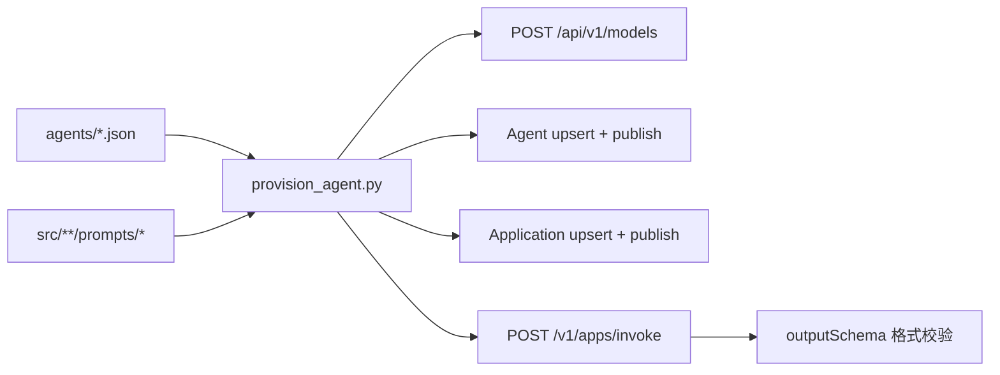

# Tender Skills 智能体平台 Provision 设计

> 日期：2026-07-05  
> 状态：已确认  
> 范围：将 `docs/agent_requirements.md` 中 16 个 call_type 注册到 df-agent-os-python 平台（Agent + Application），并提供一键 provision 与格式验证。

---

## 1. 背景与目标

tender_skills 流水线中有 16 个大模型调用点（1 call_type = 1 智能体）。需将其迁移至 **df-agent-os-python** 智能体平台，使业务层可通过 `/v1/apps/invoke` 调用，而非内嵌 prompt。

**目标**：

1. 用 **一个脚本 + 16 个配置文件** 完成创建、发布与验证
2. 每个 call_type 对应一个已发布的 Agent 与 Application（`enName` = call_type）
3. 验证保证平台接口返回 **符合 outputSchema 的结构化 JSON**
4. 脚本幂等：按 `enName` upsert，可重复执行

**环境**：

| 组件 | 地址 |
|------|------|
| 平台后端 | `http://localhost:8000` |
| 平台前端 | `http://localhost:9002/app/agents` |
| 接口文档 | `~/xlab/df-agent-os-python/docs/features.md` |
| 需求规格 | `docs/agent_requirements.md` |

---

## 2. 架构

```
scripts/
├── provision_agent.py       # 唯一脚本
└── agents/                  # 16 个 JSON 配置
    ├── outline_refine.json
    ├── chunk_classify.json
    └── ...
```



**职责边界**：

| 层 | 职责 |
|----|------|
| 平台智能体 | systemPrompt + user message 组装 → LLM 调用 → JSON 解析为 `structuredOutput` |
| provision 脚本 | 读配置 → upsert 资源 → 调用 invoke 验证格式 |
| tender_skills 业务 | 保留 `OutlineMappingValidator` 等业务后处理；不在平台内实现 |

---

## 3. 脚本接口

**文件**：`scripts/provision_agent.py`

```bash
# 单个 call_type（试点）
python scripts/provision_agent.py agents/outline_refine.json

# 全部 16 个
python scripts/provision_agent.py --all

# 只 provision，跳过 invoke 验证
python scripts/provision_agent.py agents/outline_refine.json --skip-verify

# 指定平台地址（默认 http://localhost:8000）
python scripts/provision_agent.py agents/outline_refine.json --base-url http://localhost:8000
```

**环境变量**：

| 变量 | 说明 | 默认 |
|------|------|------|
| `AGENT_PLATFORM_BASE_URL` | 平台 API 根地址 | `http://localhost:8000` |
| `LLM_API_KEY` | 创建 OCR 模型时使用（读项目 `.env`） | — |

---

## 4. Provision 流程

对每个配置文件，脚本按序执行：

### 4.1 确保模型存在

- 按配置 `modelName` 在 `POST /api/v1/models/list` 中查找
- 文本类 agent（#1–#15）：`qwen3.7-max`（平台已有 `mdl_544a969b` 可复用）
- OCR agent（#16）：`qwen-vl-ocr`；不存在则用 `.env` 中 `LLM_API_KEY` + DashScope base URL 创建

### 4.2 Agent 幂等 upsert

1. `POST /api/v1/agents/list` 按 `enName` 查找
2. 不存在 → `POST /api/v1/agents` 创建
3. `PATCH /api/v1/agents/{id}/draft` 写入完整 draft：
   - `prompt.systemPrompt` ← 读 `promptFile` 内容
   - `prompt.initialMessages` ← 配置 `initialMessages`（默认 `[]`）
   - `model.modelId` ← 上步解析的 model id
   - `io` ← `formatInput` / `inputSchema` / `formatOutput` / `outputSchema`
   - `runtime` ← `retryCount` / `timeoutMs` / `streaming` / `multiTurn`
4. `POST /api/v1/agents/{id}/validate` → 必须 `valid: true`
5. `POST /api/v1/agents/{id}/publish`

### 4.3 Application 幂等 upsert

1. `POST /api/v1/applications/list` 按 `enName` 查找
2. 不存在 → `POST /api/v1/applications` 创建（`mode=api`，绑定 agentId，`agentVersionRef.publishMode=latest`）
3. 存在 → `PUT /api/v1/applications/{id}` 更新绑定与 timeout
4. `POST /api/v1/applications/{id}/publish`（`draft` → `published`）

### 4.4 验证

`POST /v1/apps/invoke`：

```json
{
  "appName": "<enName>",
  "input": <verify.input>
}
```

---

## 5. 验证规则

验证 **只检查平台返回格式**，不与本地 LLMClient 对比。

| # | 断言 |
|---|------|
| 1 | HTTP 200 |
| 2 | 响应 `status === "completed"` |
| 3 | `structuredOutput` 为非 null 对象（`formatOutput=true` 时） |
| 4 | `structuredOutput` 包含 `outputSchema` 全部顶层字段 |
| 5 | 各字段类型与 schema 一致（string / number / boolean / object / array） |
| 6 | 若配置 `verify.pydanticModels`，对响应子对象逐个 `model_validate`（如 `OutlineTree`、`OutlineMappingFile`） |

失败时脚本 exit code 非 0，打印响应体与缺失字段。

**text 输出 agent**（`chunk_describe`、`ocr_image_recognize`）：

- `formatOutput=false`：断言 `output` 为非空 string，`structuredOutput` 为 null

**OCR agent**（#16）：

- `verify.input` 含 base64 图片或 URL；`initialMessages` 使用 multimodal 模板（参考平台已有 `image_recognize`）

---

## 6. 配置文件格式

路径：`scripts/agents/{call_type}.json`

```json
{
  "callType": "outline_refine",
  "zhName": "目录树优化",
  "enName": "outline_refine",
  "description": "根据用户指令优化文档目录树",
  "modelName": "qwen3.7-max",
  "promptFile": "src/doc_chunk/llm/prompts/outline_refine.txt",
  "draft": {
    "formatInput": true,
    "inputSchema": [
      {
        "id": "field_instruction",
        "name": "instruction",
        "type": "string",
        "required": true,
        "description": "优化指令"
      },
      {
        "id": "field_original_outline",
        "name": "original_outline",
        "type": "object",
        "required": true,
        "children": [
          { "id": "field_schema_version", "name": "schema_version", "type": "string", "required": true },
          { "id": "field_nodes", "name": "nodes", "type": "array", "required": true, "itemType": "object" }
        ]
      },
      {
        "id": "field_current_outline",
        "name": "current_outline",
        "type": "object",
        "required": true,
        "children": [
          { "id": "field_schema_version2", "name": "schema_version", "type": "string", "required": true },
          { "id": "field_nodes2", "name": "nodes", "type": "array", "required": true, "itemType": "object" }
        ]
      }
    ],
    "formatOutput": true,
    "outputSchema": [
      {
        "id": "field_outline_refined",
        "name": "outline_refined",
        "type": "object",
        "required": true,
        "children": [
          { "id": "field_or_schema_version", "name": "schema_version", "type": "string", "required": true },
          { "id": "field_or_nodes", "name": "nodes", "type": "array", "required": true, "itemType": "object" }
        ]
      },
      {
        "id": "field_node_mappings",
        "name": "node_mappings",
        "type": "array",
        "required": true,
        "itemType": "object",
        "children": [
          { "id": "field_nm_refined_node_id", "name": "refined_node_id", "type": "string", "required": true },
          { "id": "field_nm_source_node_ids", "name": "source_node_ids", "type": "array", "required": true, "itemType": "string" },
          { "id": "field_nm_markdown_range", "name": "markdown_range", "type": "object", "required": true },
          { "id": "field_nm_operation", "name": "operation", "type": "string", "required": true }
        ]
      },
      {
        "id": "field_change_summary",
        "name": "change_summary",
        "type": "string",
        "required": true
      }
    ],
    "initialMessages": [],
    "runtime": {
      "retryCount": 0,
      "timeoutMs": 60000,
      "streaming": false,
      "multiTurn": false
    }
  },
  "application": {
    "mode": "api",
    "syncType": "sync",
    "timeoutMs": 60000
  },
  "verify": {
    "input": {
      "instruction": "重命名第一章",
      "original_outline": {
        "schema_version": "1.0",
        "strategy": "heading_heuristic",
        "nodes": [
          {
            "node_id": "n1",
            "title": "第一章",
            "level": 1,
            "parent_id": null,
            "sort_order": 0,
            "anchor": { "block_index": 0 },
            "needs_review": false,
            "source_refs": []
          }
        ]
      },
      "current_outline": {
        "schema_version": "1.0",
        "strategy": "heading_heuristic",
        "nodes": [
          {
            "node_id": "n1",
            "title": "第一章",
            "level": 1,
            "parent_id": null,
            "sort_order": 0,
            "anchor": { "block_index": 0 },
            "needs_review": false,
            "source_refs": []
          }
        ]
      }
    },
    "pydanticModels": {
      "outline_refined": "doc_chunk.models.outline:OutlineTree",
      "node_mappings": "doc_chunk.models.outline:OutlineMappingFile"
    }
  }
}
```

**字段说明**：

| 字段 | 必填 | 说明 |
|------|------|------|
| `callType` | ✓ | 与 `enName` 一致，对应 `agent_requirements.md` |
| `promptFile` | ✓ | 相对项目根目录；脚本读入写入 `systemPrompt` |
| `promptText` | 二选一 | 内联 prompt，优先级低于 `promptFile` |
| `draft.initialMessages` | | 默认 `[]`；空时 runtime 用 `json.dumps(input)` 作为 user message |
| `verify.input` | ✓ | invoke 测试输入 fixture |
| `verify.pydanticModels` | | 可选，字段名 → `module:ClassName` 映射，对子对象做深度校验 |

**User message 对齐**：`initialMessages` 为空时，平台 runtime 调用 `format_input_as_message(input)`，与本地 `OutlineRefineEngine` 的 `json.dumps(user_content)` 行为一致。

---

## 7. 16 个配置文件清单

| # | 文件 | call_type | modelName | formatOutput |
|---|------|-----------|-----------|--------------|
| 1 | `outline_refine.json` | outline_refine | qwen3.7-max | json |
| 2 | `chunk_classify.json` | chunk_classify | qwen3.7-max | json |
| 3 | `chunk_describe.json` | chunk_describe | qwen3.7-max | text |
| 4 | `interpret_segment.json` | interpret_segment | qwen3.7-max | json |
| 5 | `interpret_scoring_table.json` | interpret_scoring_table | qwen3.7-max | json |
| 6 | `interpret_overview.json` | interpret_overview | qwen3.7-max | json |
| 7 | `brief_single.json` | brief_single | qwen3.7-max | json |
| 8 | `brief_segment.json` | brief_segment | qwen3.7-max | json |
| 9 | `brief_merge.json` | brief_merge | qwen3.7-max | json |
| 10 | `template_plan.json` | template_plan | qwen3.7-max | json |
| 11 | `template_extract.json` | template_extract | qwen3.7-max | json |
| 12 | `gen_catalog_initial.json` | gen_catalog_initial | qwen3.7-max | json |
| 13 | `gen_catalog_node_plan.json` | gen_catalog_node_plan | qwen3.7-max | json |
| 14 | `gen_catalog_node_apply.json` | gen_catalog_node_apply | qwen3.7-max | json |
| 15 | `legal_section_review.json` | legal_section_review | qwen3.7-max | json |
| 16 | `ocr_image_recognize.json` | ocr_image_recognize | qwen-vl-ocr | text |

Prompt 来源见 `docs/agent_requirements.md` §4 与 §8 源码索引。

---

## 8. 实施顺序

1. **试点**：实现 `provision_agent.py` + `agents/outline_refine.json`，手动跑通 provision + verify
2. **脚本定型**：确认 upsert / publish / verify 逻辑稳定
3. **批量配置**：按 §7 清单依次添加 15 个 JSON，每个跑 verify
4. **OCR**：创建 `qwen-vl-ocr` 模型 + `ocr_image_recognize.json`（multimodal 配置）

---

## 9. 平台能力差距（不阻塞 MVP）

| 差距 | 影响 | MVP 处理 |
|------|------|----------|
| 无 `response_format=json` | LLM 可能返回 markdown 围栏 | 依赖 prompt 约束；平台 `parse_json_object` 可解析围栏 |
| `retryCount` 仅重试 API 错误 | 不含业务 schema 重试 | 配置 `retryCount=0`；业务重试留在 tender_skills |
| 无业务校验器 | 如不跑 `OutlineMappingValidator` | verify 只验 JSON 格式，不验映射规则 |
| 复杂嵌套 inputSchema UI 编辑难 | 无影响 | invoke 走整包 JSON，schema 仅标记顶层必填 |

**建议平台后续（P2）**：

- `runtime.responseFormat: text | json`，传给 OpenAI 兼容 API
- `formatOutput=true` 时可选按 `outputSchema` 做运行时校验

---

## 10. 错误处理

| 场景 | 行为 |
|------|------|
| 平台不可达 | 打印错误，exit 1 |
| validate 失败 | 打印 `errors` 列表，exit 1 |
| invoke 非 200 / status 非 completed | 打印响应，exit 1 |
| structuredOutput 缺字段 | 打印缺失字段名，exit 1 |
| `--all` 某个 agent 失败 | 记录失败项，全部跑完后汇总 exit 1 |

---

## 11. 测试计划

| 步骤 | 验证 |
|------|------|
| 试点 outline_refine | `python scripts/provision_agent.py agents/outline_refine.json` 成功 |
| 幂等重跑 | 同一命令再执行，无 duplicate 错误，版本递增 |
| 前端可见 | `http://localhost:9002/app/agents` 出现「目录树优化」且已发布 |
| 生产 invoke | `curl POST /v1/apps/invoke` 返回合法 `structuredOutput` |
| 全量 | `--all` 16 个均 verify 通过 |

---

## 12. 决策记录

| 决策 | 选择 |
|------|------|
| 发布范围 | Agent + Application 全套 |
| 脚本形态 | 单脚本 + 16 JSON 配置 |
| 验证标准 | 平台 invoke 返回符合 outputSchema |
| 脚本行为 | 幂等 upsert（按 enName） |
| 试点 agent | outline_refine |
| 业务校验 | 留在 tender_skills，不在平台 |
