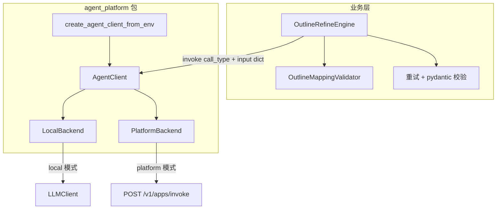

# Agent Platform Invoke 设计

> 日期：2026-07-06  
> 状态：已实现（2026-07-06）  
> 范围：将 tender_skills 业务层的大模型调用从「内嵌 prompt + LLMClient」迁移为「统一 invoke 接口 + df-agent-os 平台 API」，以 `outline_refine` 为试点。

---

## 1. 背景与目标

### 1.1 现状

- 16 个 `call_type` 已通过 `scripts/provision_agent.py` 注册到 **df-agent-os-python**，可通过 `POST /v1/apps/invoke` 调用（`appName` = `enName` = `call_type`）。
- 业务代码仍直接调用 `LLMClient.complete()`，自行组装 messages、解析 JSON、做校验与重试。
- `docs/agent_requirements.md` §7.1 已有 `AgentRegistry.invoke(call_type, input)` 草案，尚未落地。

### 1.2 目标

1. **不影响原有逻辑**：校验、重试、持久化、CLI 行为保持不变；默认运行模式与现网一致。
2. **试点先行**：先完成 `outline_refine`，验证通过后再迁移其余 15 个 call_type。
3. **统一可复用封装**：所有 call_type 共用同一套 invoke 请求/响应格式与客户端。

### 1.3 已确认决策

| 决策项 | 选择 |
|--------|------|
| 运行模式 | 环境变量 `AGENT_INVOKE_MODE=local\|platform`，**默认 `local`** |
| 试点 call_type | `outline_refine` |
| 包位置 | 独立顶层包 `src/agent_platform/` |
| 返回形态 | 薄封装 `AgentInvokeResult`（业务层自行 pydantic 校验） |

---

## 2. 架构

### 2.1 组件关系



### 2.2 职责边界

| 层 | 职责 |
|----|------|
| `agent_platform` | 统一请求/响应、HTTP 调用、local/platform 模式切换 |
| 业务 Engine / Extractor | 组装 input dict、解析 output、业务校验、重试、落盘 |
| df-agent-os 平台 | systemPrompt + user message 组装 → LLM → `structuredOutput` / `output` |
| provision 脚本 | 平台资源 upsert 与格式验证（已实现，不在本设计范围） |

### 2.3 方案对比（已选方案 1）

| 方案 | 说明 | 结论 |
|------|------|------|
| **1. AgentClient + 双 Backend** | 业务只调 `invoke()`，local/platform 由 backend 切换 | **采用** |
| 2. PlatformLLMClient 实现 LLMClient | 伪造 messages，与平台 inputSchema 模型冲突 | 否决 |
| 3. Engine 内部分支 | 16 处重复 mode 判断 | 否决 |

---

## 3. 包结构

```
src/agent_platform/
├── __init__.py              # 导出 AgentClient, AgentInvokeResult, create_agent_client_from_env
├── models.py                # AgentInvokeRequest, AgentInvokeResult, AgentInvokeError
├── client.py                # AgentClient.invoke()
├── factory.py               # create_agent_client_from_env()
├── json_coerce.py           # structuredOutput 解析（从 output 字符串提取 JSON）
├── backends/
│   ├── base.py              # AgentBackend Protocol
│   ├── local.py             # LocalBackend：按 call_type 分发
│   └── platform.py          # PlatformBackend：HTTP POST /v1/apps/invoke
└── handlers/
    └── outline_refine.py    # local 模式：现有 prompt + LLMClient
```

**依赖关系**：

- `agent_platform` 依赖 `doc_chunk.llm`（`LLMClient`、`create_llm_client_from_env`）
- `doc_chunk`、`tender_insights` 依赖 `agent_platform`
- 无需新增第三方依赖；`pyproject.toml` 的 `setuptools.packages.find where = ["src"]` 自动发现该包

---

## 4. 统一请求/响应格式

### 4.1 AgentInvokeRequest

```python
@dataclass
class AgentInvokeRequest:
    call_type: str              # = platform appName = scripts/agents/{call_type}.json enName
    input: dict[str, Any]       # 与对应 JSON 配置的 inputSchema 字段对齐
```

### 4.2 AgentInvokeResult

```python
@dataclass
class AgentInvokeResult:
    call_type: str
    status: str                 # 平台返回的 status，local 模式固定 "completed"
    structured_output: dict | None
    text_output: str | None
    raw_response: dict          # 完整原始响应，便于调试与日志
    duration_ms: int | None = None
```

### 4.3 AgentClient 接口

```python
class AgentClient:
    def invoke(self, call_type: str, input: dict[str, Any]) -> AgentInvokeResult: ...
```

**约定**：

- `formatOutput=true` 的 call_type（如 `outline_refine`）：业务读取 `structured_output`
- `formatOutput=false` 的 call_type（如 `chunk_describe`）：业务读取 `text_output`
- input dict 的 key 与 `scripts/agents/{call_type}.json` 的 `inputSchema.name` 一致，便于 local/platform 行为对齐

---

## 5. Backend 实现

### 5.1 LocalBackend

- 按 `call_type` 分发到 `handlers/` 下的 local handler
- handler 内部复用现有 prompt 文件与 `LLMClient.complete()` 逻辑
- 将 LLM 原始 JSON 字符串解析为 dict，填入 `AgentInvokeResult.structured_output`
- `outline_refine` handler 输入/输出与平台 schema 一致：

**Input**：

```json
{
  "instruction": "...",
  "original_outline": { "schema_version": "1.0", "nodes": [...] },
  "current_outline": { "schema_version": "1.0", "nodes": [...] }
}
```

**Output（structured_output）**：

```json
{
  "outline_refined": { ... },
  "node_mappings": [ ... ],
  "change_summary": "..."
}
```

### 5.2 PlatformBackend

- `POST {AGENT_PLATFORM_BASE_URL}/v1/apps/invoke`
- 请求体：`{"appName": call_type, "input": input_dict}`
- 响应映射：
  - `status` → `AgentInvokeResult.status`
  - `structuredOutput` → `structured_output`（若为 dict）
  - 若仅有 `output` 字符串，经 `json_coerce.py` 提取 JSON object（与 `scripts/provision_agent.py` 的 `_coerce_structured_output` 逻辑一致）
  - `output`（非 JSON）→ `text_output`
- 完整响应存入 `raw_response`

### 5.3 Factory

```python
def create_agent_client_from_env(*, llm_client: LLMClient | None = None) -> AgentClient:
    mode = os.environ.get("AGENT_INVOKE_MODE", "local").strip().lower()
    if mode == "platform":
        base_url = os.environ.get("AGENT_PLATFORM_BASE_URL", "http://localhost:8000")
        return AgentClient(PlatformBackend(base_url=base_url))
    if mode != "local":
        raise ValueError(f"unsupported AGENT_INVOKE_MODE: {mode}")
    client = llm_client or create_llm_client_from_env()
    return AgentClient(LocalBackend(llm_client=client))
```

| 环境变量 | 默认 | 说明 |
|----------|------|------|
| `AGENT_INVOKE_MODE` | `local` | `local` 或 `platform` |
| `AGENT_PLATFORM_BASE_URL` | `http://localhost:8000` | platform 模式 API 根地址 |

---

## 6. outline_refine 试点改动

### 6.1 改动文件

| 文件 | 变更 |
|------|------|
| `src/agent_platform/**` | 新增 |
| `src/doc_chunk/outline_refine/engine.py` | 构造参数 `llm_client` → `agent_client`；`run_round` 内改用 `agent_client.invoke()` |
| `src/doc_chunk/api.py` | `refine_outline` 使用 `create_agent_client_from_env(llm_client=llm_client)` |
| `tests/unit/test_refine_engine.py` | `AgentClient(LocalBackend(FakeLLMClient(...)))` |

### 6.2 不改动的部分

- `OutlineMappingValidator`、`RefineSession`、preview/persist、CLI 命令
- 重试次数（`max_retries=2`）与 `ValidationError` 语义
- `AGENT_INVOKE_MODE=local`（默认）时的对外行为

### 6.3 Engine 调用示例（概念）

```python
result = self.agent_client.invoke(
    "outline_refine",
    {
        "instruction": instruction,
        "original_outline": original_outline.model_dump(mode="json"),
        "current_outline": base_outline.model_dump(mode="json"),
    },
)
payload = result.structured_output
if not isinstance(payload, dict):
    last_errors = ["LLM response missing structured output"]
    continue
# 后续 outline_refined / node_mappings / change_summary 解析与校验不变
```

---

## 7. 错误处理

| 场景 | 行为 |
|------|------|
| platform HTTP 4xx/5xx | 抛 `AgentInvokeError`（含 HTTP status 与 response body） |
| platform `status != "completed"` | 抛 `AgentInvokeError` |
| `structured_output` 缺失或 schema 不符 | 由 Engine 现有 retry 逻辑处理（等同 JSON 解析/校验失败） |
| local 模式 LLM 环境未配置 | 保持现有 `LLMUnavailableError` |
| 未知 `call_type`（local handler 未注册） | 抛 `AgentInvokeError` |

**不做 silent fallback**：platform 模式失败时不自动回退 local，避免生产环境行为不可预期。

---

## 8. 测试策略

| 层级 | 内容 | CI 依赖 |
|------|------|---------|
| 单元 | `PlatformBackend` HTTP mock；`json_coerce` 边界 | 无网络 |
| 单元 | `LocalBackend` + `FakeLLMClient` + `outline_refine` handler | 无网络 |
| 单元 | `test_refine_engine.py` 经 `AgentClient` 包装，断言与迁移前一致 | 无网络 |
| 集成（可选） | `AGENT_INVOKE_MODE=platform` + 本地平台 + provision 过的 `outline_refine` | 需平台运行 |

---

## 9. 后续迁移（15 个 call_type）

每个 call_type 迁移步骤相同：

1. 在 `agent_platform/handlers/` 增加 local handler（从现有 extractor 提取 prompt + LLM 调用）
2. 业务层将 `llm_client.complete(...)` 替换为 `agent_client.invoke(call_type, input_dict)`
3. 核对 `scripts/agents/{call_type}.json` 的 inputSchema 与 handler 输入一致
4. 补充 handler 单元测试；可选 platform 集成验证

**建议顺序**（与 `docs/agent_requirements.md` §7.2 一致）：

1. `chunk_classify`、`chunk_describe`、`ocr_image_recognize`
2. `interpret_segment`、`interpret_scoring_table`、`interpret_overview`
3. `brief_single`、`brief_segment`、`brief_merge`
4. `gen_catalog_initial`、`gen_catalog_node_plan`、`gen_catalog_node_apply`
5. `template_plan`、`template_extract`、`legal_section_review`

---

## 10. 非目标

- 不在本阶段重构 `scripts/provision_agent.py`（可选后续将 HTTP 客户端抽到 `agent_platform` 复用）
- 不在平台内实现 `OutlineMappingValidator` 等业务后处理
- 不在本阶段迁移除 `outline_refine` 外的 call_type
- 不引入 typed Registry（每 call_type Input/Output 模型）；保留薄封装，业务层继续 pydantic 校验

---

## 11. 验收标准（outline_refine 试点）

- [x] `AGENT_INVOKE_MODE=local`（默认）：现有单元测试与 integration refine CLI 测试全部通过
- [x] `AGENT_INVOKE_MODE=platform`：对已 provision 的 `outline_refine` 调用成功，Engine 校验通过
- [x] `AgentClient.invoke("outline_refine", {...})` 请求/响应格式 documented 且可被后续 call_type 复用
- [x] 无 `llm_client.complete` 直接调用残留在 `OutlineRefineEngine`
