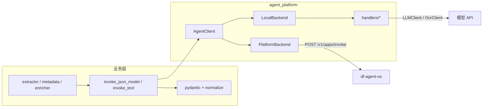

# Agent Platform 剩余 15 个 call_type 迁移设计

> 日期：2026-07-06  
> 状态：Draft  
> 前置：`docs/superpowers/specs/2026-07-06-agent-platform-invoke-design.md`（试点 `outline_refine` 已完成）  
> 范围：将其余 15 个大模型/OCR 调用迁到 `AgentClient.invoke(call_type, input)`。

---

## 1. 目标与约束

### 1.1 目标

- 业务层不再直接调用 `LLMClient.complete` / `OcrClient.recognize_*` / `extract_json_model`。
- local / platform 模式共用同一套 `call_type` + `input` schema（以 `scripts/agents/{call_type}.json` 为准）。
- 校验与重试留在业务侧（或薄封装 helper），agent handler **只做** prompt 组装 + 模型调用 + 原始结构化/文本解析。

### 1.2 已定决策（沿用试点）

| 项 | 决策 |
|----|------|
| 重试语义 | **同 input 盲重试**；不再把 `Previous JSON invalid: …` 追加进 messages |
| validator / normalize | 留在业务层（handler 不跑 pydantic 业务模型 / OutlineMappingValidator） |
| silent fallback | platform 失败不回退 local |
| typed Registry | 不做；input/output 继续 `dict` + 业务侧 pydantic |

### 1.3 非目标

- 不改 `scripts/agents/*.json` 的 `inputSchema` / `enName`（除非发现与代码不可兼容的 bug）。
- 不在本阶段把 prompt 全部物理搬进 `agent_platform/prompts/`（handler 可读现有 `prompts.py` / `.txt`）。
- 不重写 Viewer pipeline 编排；只替换 LLM 调用点。

---

## 2. 架构



### 2.1 共享 helper（替代 `extract_json_model`）

新增 `src/agent_platform/structured.py`：

```python
def invoke_json_model(
    agent_client: AgentClient,
    call_type: str,
    input: dict[str, Any],
    model_type: type[T],
    *,
    max_retries: int = 2,
    normalize: Callable[[dict[str, Any]], dict[str, Any]] | None = None,
    log_context: dict[str, Any] | None = None,
) -> T:
    """盲重试：每次 invoke 使用同一 input；校验失败不反馈给模型。"""

def invoke_text(
    agent_client: AgentClient,
    call_type: str,
    input: dict[str, Any],
    *,
    max_retries: int = 0,
    log_context: dict[str, Any] | None = None,
) -> str:
    """读取 result.text_output；空串 / AgentInvokeError 可按 max_retries 盲重试。"""
```

行为：

1. `agent_client.invoke(call_type, input)`（同一 `input`）。
2. JSON 类：取 `structured_output`；可选 `normalize(data)`（interpret 专用）；`model_type.model_validate`。
3. 文本类：取 `text_output`。
4. `AgentInvokeError` / JSON 解析失败 / `ValidationError`：记入 `log_context`（若有），进入下一次盲重试。
5. 耗尽后抛既有业务异常：`LLMExtractionError`（tender_insights）或返回 `None`/既有语义（doc_chunk metadata，保持调用方约定）。

`tender_insights.common.llm_extractor.extract_json_model`：迁移完成后删除或改为薄包装调用 `invoke_json_model`（过渡期可保留 deprecated）。

### 2.2 LocalBackend 扩展

当前 `Handler = Callable[[LLMClient, dict], AgentInvokeResult]`，OCR 需要 `OcrClient`。

```python
class LocalBackend:
    def __init__(
        self,
        *,
        llm_client: LLMClient,
        ocr_client: OcrClient | None = None,
    ) -> None: ...

    def invoke(self, call_type: str, input: dict[str, Any]) -> AgentInvokeResult:
        if call_type == "ocr_image_recognize":
            if self._ocr_client is None:
                raise AgentInvokeError("ocr_image_recognize requires ocr_client in local mode")
            return invoke_ocr_image_recognize(self._ocr_client, input)
        handler = _HANDLERS.get(call_type)
        ...
```

`create_agent_client_from_env`：

- local：可注入 `llm_client` / `ocr_client`；缺省时 `create_llm_client_from_env()`，OCR 按需 `OcrClient.from_env(model=OCR_MODEL)`（仅当首次调用 OCR 或构造时按需创建，避免无 OCR 流水线强依赖）。
- platform：仍只建 `PlatformBackend`，不碰 LLM/OCR。

文本 handler 签名保持 `(llm_client, input) -> AgentInvokeResult`。

### 2.3 Handler 约定

每个 `call_type` 一个模块：`src/agent_platform/handlers/{call_type}.py`（文件名与 `enName` 一致，下划线形式）。

每个 handler：

1. 校验 `input` 必填字段（缺则 `AgentInvokeError`）。
2. 用既有 prompt 资源组装 messages（与 platform `promptText` / `initialMessages` 语义对齐）。
3. 调用 `llm_client.complete(..., response_format="json"|"text")` 或 `ocr_client`。
4. JSON：`json.loads` → `structured_output`；非法 JSON → `AgentInvokeError`。
5. 文本：写入 `text_output`，`structured_output=None`。
6. **不**做业务 pydantic 校验、**不**做跨字段业务 normalize（interpret normalize 放在 `invoke_json_model` 的 `normalize=` 回调）。

`formatOutput=true` / `false` 与 `scripts/agents/*.json` 一致：

| 输出模式 | call_type | 业务读取 |
|----------|-----------|----------|
| structured | 除下列以外的全部 | `structured_output` |
| text | `chunk_describe`, `ocr_image_recognize` | `text_output` |

### 2.4 日志

- `log_context`：继续写 `llm_calls.jsonl`（`call_type`、`segment_id`、attempt、success、response_raw / validation_error）。
- platform 模式通常无 `usage` / `model` / `finish_reason`：字段记 `null`，`duration_ms` 用 `AgentInvokeResult.duration_ms`（若有）。
- prompt 原文日志：业务层在 invoke **前**继续 `log_llm_prompt`（messages 由业务或可选 debug helper 组装）。为对齐 platform，**不以 messages 作为 invoke 入参**；若需审计 messages，local handler 可在 debug 级别自打日志，不作为稳定接口。

---

## 3. call_type 清单与输入契约

输入 key 必须与 `scripts/agents/{call_type}.json` → `draft.inputSchema[].name` 一致。

| # | call_type | 当前源码 | input keys（摘要） | output |
|---|-----------|----------|-------------------|--------|
| 1 | `chunk_classify` | `doc_chunk/metadata/classify.py` | `title`, `markdown` | structured |
| 2 | `chunk_describe` | `doc_chunk/metadata/describe.py` | `title`, `markdown` | text |
| 3 | `ocr_image_recognize` | `tender_insights/common/ocr/*` | `image_url` | text |
| 4 | `interpret_segment` | `interpret/extractor.py` | `segment_id`, `section_path`, `markdown` | structured |
| 5 | `interpret_scoring_table` | 同上（scoring 段） | 同 segment | structured |
| 6 | `interpret_overview` | `interpret/overview.py` | 以 agent JSON 为准 | structured |
| 7 | `brief_single` | `brief/extractor.py` | 以 agent JSON 为准 | structured |
| 8 | `brief_segment` | 同上 | 以 agent JSON 为准 | structured |
| 9 | `brief_merge` | 同上 | 以 agent JSON 为准 | structured |
| 10 | `gen_catalog_initial` | `gen_catalog/extractor.py` | 以 agent JSON 为准 | structured |
| 11 | `gen_catalog_node_plan` | 同上 | 以 agent JSON 为准 | structured |
| 12 | `gen_catalog_node_apply` | 同上 | 以 agent JSON 为准 | structured |
| 13 | `template_plan` | `template/planner.py` | 以 agent JSON 为准 | structured |
| 14 | `template_extract` | `template/extractor.py` | 以 agent JSON 为准 | structured |
| 15 | `legal_section_review` | `legal/extractor.py` | 以 agent JSON 为准 | structured |

实现时逐步对照每个 JSON 的 `verify.input` 与业务现有 messages 字段，**以 JSON schema 为唯一合同**；若业务当前拼进 prompt 的字段多于 schema，要么把缺字段补进 schema（需同步 provision），要么在 handler 内仅用 schema 字段（推荐，先保证可调通）。

### 3.1 OCR 特例

- 业务现状：`recognize_image_bytes(image_bytes)`。
- Agent 合同：`image_url`（HTTP URL 或 data URI）。
- 业务适配：`data:{mime};base64,{b64}` 写入 `image_url`，再 `invoke_text(..., "ocr_image_recognize", {"image_url": ...})`。
- local handler：`OcrClient` 增加 `recognize_image_url(image_url: str) -> str`（现逻辑提取 data URI 分支）；HTTP URL 由 OpenAI 兼容视觉 API 拉取。
- `enricher` 等调用方改依赖 `AgentClient`，不再直接持有 `OcrClient`（测试可注入 Fake backend）。

### 3.2 interpret 双 call_type

`extractor.py` 今日按 `seg.segment_id.startswith("seg-scoring-")` 选日志 `call_type`（`segment` / `scoring_table`）。迁移后：

- 日志与 invoke：`interpret_segment` / `interpret_scoring_table`（与 `scripts/agents` 的 `enName` 一致）。
- Viewer 若过滤旧字符串，同步兼容新旧名称或只认新名称（实现计划里列检查项）。

### 3.3 chunk_classify 规则短路

`classify_chunk` 先跑规则匹配，命中则不调 LLM。迁移后：

- 规则短路保留在业务函数。
- 仅 LLM 分支改为 `invoke_json_model(..., "chunk_classify", {"title", "markdown"}, ...)`。
- 返回 dict 的后处理（`suggested_*`）仍在业务层。

---

## 4. 业务层改动模式（模板）

以 interpret segment 为例：

**之前：**

```python
messages = build_segment_messages(...)
batch = extract_json_model(client, messages, InterpretationLLMResponse, ...)
```

**之后：**

```python
batch = invoke_json_model(
    agent_client,
    "interpret_segment",
    {
        "segment_id": seg.segment_id,
        "section_path": seg.section_path,
        "markdown": markdown,
    },
    InterpretationLLMResponse,
    max_retries=config.max_retries,
    normalize=lambda data: normalize_interpretation_llm_data(data, section_path=seg.section_path),
    log_context={"call_type": "interpret_segment", "segment_id": seg.segment_id},
)
```

API / CLI 入口：凡构造 `LLMClient` 的地方改为 `create_agent_client_from_env(llm_client=...)`（与 `refine_outline` 一致），并向下传 `agent_client`。

公开函数签名：

- 优先 `agent_client: AgentClient`。
- 过渡期若大量测试传 `llm_client`，可在函数内 `agent_client = create_agent_client_from_env(llm_client=llm_client)`，避免一次改爆所有测试；目标态删除 `llm_client` 参数。

---

## 5. 迁移顺序与批次

与试点设计 §9 / `agent_requirements.md` §7.2 对齐，**分批合并**，每批可独立测：

| 批次 | call_type | 包 |
|------|-----------|-----|
| A | `chunk_classify`, `chunk_describe`, `ocr_image_recognize` | doc_chunk + ocr |
| B | `interpret_segment`, `interpret_scoring_table`, `interpret_overview` | tender_insights.interpret |
| C | `brief_single`, `brief_segment`, `brief_merge` | tender_insights.brief |
| D | `gen_catalog_initial`, `gen_catalog_node_plan`, `gen_catalog_node_apply` | tender_insights.gen_catalog |
| E | `template_plan`, `template_extract`, `legal_section_review` | template + legal |

每批完成定义：

1. 对应 handlers 注册进 `LocalBackend._HANDLERS`（OCR 特例除外）。
2. 业务调用点无直接 `complete` / `extract_json_model` / `OcrClient.recognize_*`（规则短路等非 LLM 路径除外）。
3. 既有单元测试通过（FakeLLM + `AgentClient(LocalBackend(...))`）。
4. handler 单测：input fixture → structured/text 字段存在。

可选：每批后对已 provision agent 跑一次 platform smoke（与试点相同）。

---

## 6. 测试策略

| 层级 | 内容 |
|------|------|
| handler 单元 | 各 `invoke_*` + FakeLLMClient / FakeOcr，断言 `AgentInvokeResult` 形态 |
| helper 单元 | `invoke_json_model` 盲重试：第一次非法 JSON、第二次合法；messages 不被增长（通过 Fake 计数 invoke 次数与 input 相等） |
| 业务单元 | 现有测试改为注入 `AgentClient(LocalBackend(FakeLLM))`；断言业务输出不变 |
| 回归 | interpret / brief / gen_catalog / template / legal / metadata / ocr 相关测试全绿 |
| 集成（可选） | `AGENT_INVOKE_MODE=platform` 抽 1–2 个 call_type smoke |

---

## 7. 错误与兼容

| 场景 | 行为 |
|------|------|
| local 未注册 handler | `AgentInvokeError` |
| local OCR 无 ocr_client | `AgentInvokeError` |
| platform HTTP / status 异常 | `AgentInvokeError`（既有 PlatformBackend） |
| 校验耗尽 | `LLMExtractionError` 或 doc_chunk 既有返回（`None` / 降级） |
| 部分迁移期 | 已迁 call_type 走 AgentClient；未迁仍走旧路径（短窗口允许，目标全清） |

---

## 8. 验收标准

- [ ] 15 个 call_type 均有 local handler（OCR 走 ocr_client 分发）。
- [ ] `grep` 业务包内无面向这 15 类的裸 `llm_client.complete` / `extract_json_model` / `recognize_image_bytes`（测试 helper 除外）。
- [ ] `AGENT_INVOKE_MODE=local` 默认全量单元/集成绿。
- [ ] `invoke_json_model` 重试不注入 validation feedback。
- [ ] 日志 `call_type` 与 `scripts/agents/*/enName` 对齐（interpret 旧别名已切换）。

---

## 9. 实现备注

- Prompt 来源：handler 内 import 现有 `*_prompts` 或读 `.txt`，避免复制漂移；长期可再抽到 `agent_platform/prompts/`。
- `chunk_classify` / `chunk_describe` 今日 prompt 与 agent JSON 的 user 模板略有差异（如 truncate 长度）；handler **以 agent 合同字段**组装，truncate 策略可在 handler 内保留 `[:3000]` / `[:4000]`，与现网行为接近即可。
- 不在本设计范围修改 provision 脚本；schema bug 另开变更。
