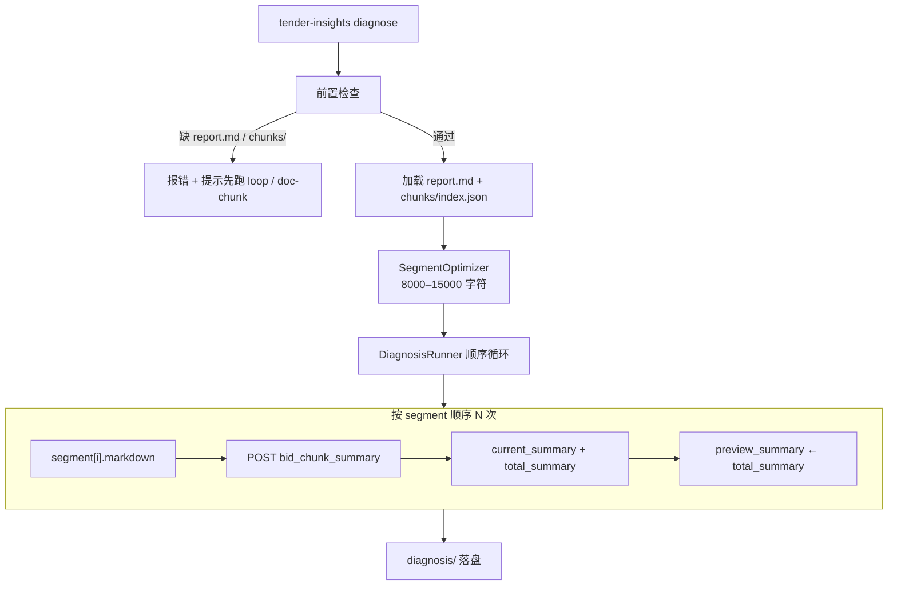

# Tender Diagnosis 设计

> 日期：2026-07-07  
> 状态：待实现  
> 范围：在 `tender_insights` 中新增 `diagnose` 子命令，对招标文件工作区按优化分段顺序调用平台应用 `bid_chunk_summary`，产出滚动概要诊断结果。

---

## 1. 背景与目标

### 1.1 现状

- `doc_chunk pipeline` 可将招标文件提取为工作区（`content.md` + `chunks/`）。
- `tender-insights loop` 通过 `tender_summary_app` 顺序解读全文，产出 `summary_loop/report.md`（招标文件解读报告）。
- `doc_chunk` 默认分块粒度不保证适合 LLM 滚动概要（可能过小或过大）。
- 尚无模块在「解读报告 + 分片正文」上下文下，按顺序生成片段概述与滚动整体概述。

### 1.2 目标

构建独立的**诊断模块**，作为 `tender-insights diagnose` 子命令：

1. 读取已有工作区的 `chunks/` 与 `summary_loop/report.md`。
2. 将 `doc_chunk` 切片优化为 **8000–15000 字符**的分段（最后一段除外）。
3. 按顺序 invoke `bid_chunk_summary`，滚动传递 `preview_summary`（上一段的 `total_summary`）。
4. 将分段计划、逐步结果与最终整体概述落盘到 `diagnosis/`。

### 1.3 已确认决策

| 决策项 | 选择 |
|--------|------|
| 处理对象 | **招标文件**（工作区 `content.md` + `chunks/`） |
| `tender_report` 来源 | `summary_loop/report.md` |
| 前置条件 | **严格依赖**：缺 `report.md` 或 `chunks/` 则报错，提示先跑 `loop` + `doc-chunk pipeline` |
| 输入分段字数 | 除最后一段外，每段 **8000–15000 字符**；超大单 chunk 按行/段落拆分 |
| 落盘 | `diagnosis/` 目录（`segments.json` + `chunks/` + `run_state.json` + `total_summary.md`） |
| 智能体应用 | `bid_chunk_summary`，**structuredOutput** 为 JSON |
| 调用模式 | **仅 platform**，不走 local handler |
| API 认证 | `AGENT_PLATFORM_API_KEY` → `X-API-Key` 请求头 |
| 失败策略 | 与 `summary_loop` 一致：非超时重试 1 次；**超时立即中止、不重试** |
| invoke 超时 | 默认 **600s** |
| 方案选型 | 独立 `diagnosis/` 子包（镜像 `summary_loop`，不复用 `PlatformBackend`） |

---

## 2. 架构

### 2.1 数据流



### 2.2 组件职责

| 组件 | 职责 |
|------|------|
| `loader.py` | 校验 `summary_loop/report.md`、`chunks/index.json`；加载解读报告与原始 chunks |
| `segment_optimizer.py` | 将 doc_chunk 切片合并/拆分为符合字数约束的 `diagnosis_segments` |
| `DiagnosisClient` | 专用 HTTP 客户端：API Key、600s 超时、读 `structuredOutput` JSON |
| `DiagnosisRunner` | 维护 `preview_summary`，按 segment 顺序 invoke |
| `writer.py` | 落盘 `segments.json`、`chunks/`、`run_state.json`、`total_summary.md` |

### 2.3 不复用 `agent_platform.PlatformBackend` 的原因

1. 现有 `PlatformBackend` 默认超时 **180s**，不满足 600s。
2. 需要 `X-API-Key` 请求头。
3. 本模块读 **structuredOutput**（JSON），`summary_loop` 读纯文本 `output`；专用 client 边界更清晰。

---

## 3. 分段优化（SegmentOptimizer）

在调用智能体之前，对 `doc_chunk` 产出的 chunks 做字数优化。

### 3.1 原子化拆分（`_atomize_pieces`）

对每个 `ContentChunk.markdown`：

- 若 `len ≤ 15000`：作为 1 个 atom。
- 若 `len > 15000`：按**行/段落**累积分拆（思路同 `segment_planner._split_oversized`，阈值改为**字符数**）：
  - 逐行累加，超过 15000 则 flush 当前段。
  - 保留 `section_path`、`source_chunk_id` 元数据。

### 3.2 贪心装箱（`_pack_segments`）

将 atoms 顺序装入 segment：

| 规则 | 说明 |
|------|------|
| 非末段下限 | `8000 ≤ len(segment) ≤ 15000` |
| 末段 | 无下限/上限约束，承接剩余全部内容 |
| 仅 1 段 | 视为末段，豁免 8000 下限 |
| 装箱策略 | 累加 atom 直到再加会超 15000；若当前 `≥ 8000` 则 flush；若 `< 8000` 且下一 atom 合并后仍 `≤ 15000` 则继续累加 |

**示例：**

```
atoms: [4000, 5000, 3000, 9000, 500]
→ seg1: 4000+5000+3000 = 12000 ✓
→ seg2（末段）: 9000+500 = 9500 ✓
```

### 3.3 分段计划模型

```python
@dataclass(frozen=True)
class DiagnosisSegment:
    segment_index: int          # 1-based
    markdown: str
    char_count: int
    source_chunk_ids: list[str]
    section_path: list[str]     # 首 atom 的 section_path
```

装箱结果写入 `diagnosis/segments.json`，供调试与下游消费。

---

## 4. Invoke 契约

### 4.1 平台调用

```http
POST {AGENT_PLATFORM_BASE_URL}/v1/apps/invoke
Content-Type: application/json
X-API-Key: {AGENT_PLATFORM_API_KEY}

{
  "appName": "bid_chunk_summary",
  "input": {
    "chunk": "当前分段正文",
    "tender_report": "summary_loop/report.md 全文",
    "total_chunk_count": "5",
    "current_count": "2",
    "preview_summary": "上一段的 total_summary（首段为空字符串）"
  }
}
```

### 4.2 输入字段

| 字段 | 说明 |
|------|------|
| `chunk` | 优化后当前分段正文 |
| `tender_report` | `summary_loop/report.md` 全文，全程不变 |
| `total_chunk_count` | 优化后分段总数，**字符串** |
| `current_count` | 当前分段序号（1-based），**字符串** |
| `preview_summary` | 上一段响应的 `total_summary`；第 1 段为 `""` |

### 4.3 输出（structuredOutput）

```json
{
  "current_summary": "当前片段概述",
  "total_summary": "滚动整体概述"
}
```

**响应读取：** `status === "completed"` 时取 `structuredOutput` 并校验 `current_summary`、`total_summary` 为非空字符串；若缺失则视为 invoke 失败。

---

## 5. 超时与错误处理

### 5.1 环境变量

| 变量 | 默认 | 说明 |
|------|------|------|
| `AGENT_PLATFORM_BASE_URL` | `http://localhost:8000` | 平台 API 根地址 |
| `AGENT_PLATFORM_API_KEY` | — | `X-API-Key`（必填） |
| `DIAGNOSIS_INVOKE_TIMEOUT_S` | `600` | 单次 invoke 客户端超时（秒） |

### 5.2 行为矩阵

| 场景 | 行为 |
|------|------|
| 正常完成（< 600s） | 写入该步结果，更新 `preview_summary`，继续下一段 |
| **提前超时** | **立即中止，不重试**；保留已完成步骤 + 错误诊断 |
| HTTP 4xx/5xx、无效 structuredOutput、`status != completed` | 重试 1 次，仍失败则中止 |
| 循环中止 | `run_state.json` 标记 `failed`；CLI exit code 非 0 |

### 5.3 前置缺失错误

| 缺失 | 错误类型 | 提示 |
|------|----------|------|
| `summary_loop/report.md` | `DiagnosisPrerequisiteError` | 请先运行 `tender-insights loop ...` |
| `chunks/index.json` 或为空 | `DiagnosisPrerequisiteError` | 请先运行 `doc-chunk pipeline ...` |

### 5.4 重试边界

- **超时** → 不重试
- **其他可恢复错误** → 最多重试 1 次（共 2 次尝试）

---

## 6. 落盘结构

```
{workspace}/diagnosis/
├── segments.json              # 优化后分段计划
├── run_state.json             # 运行状态、每步耗时、错误诊断
├── chunks/
│   ├── 001_summary.json
│   └── ...
└── total_summary.md           # 最后一段的 total_summary
```

### 6.1 `segments.json`

```json
{
  "schema_version": "1.0",
  "min_chars": 8000,
  "max_chars": 15000,
  "total_segments": 5,
  "segments": [
    {
      "segment_index": 1,
      "char_count": 12450,
      "source_chunk_ids": ["chunk-003", "chunk-004"],
      "section_path": ["第一章", "项目概况"]
    }
  ]
}
```

### 6.2 `chunks/001_summary.json`

```json
{
  "schema_version": "1.0",
  "segment_index": 1,
  "char_count": 12450,
  "source_chunk_ids": ["chunk-003", "chunk-004"],
  "current_summary": "...",
  "total_summary": "...",
  "duration_ms": 32000,
  "attempt": 1
}
```

### 6.3 `run_state.json`

与 `summary_loop/run_state.json` 结构对齐：`status`、`completed_segments`、`failed_segment`、`error_type`、`elapsed_ms`、`configured_timeout_s` 等。

---

## 7. 包结构与 API

### 7.1 目录

```
src/tender_insights/diagnosis/
├── __init__.py
├── models.py              # DiagnosisSegment, ChunkSummaryOutput, DiagnosisRunResult
├── segment_optimizer.py   # 8000–15000 字符分段
├── loader.py              # 前置校验 + 加载
├── client.py              # DiagnosisClient
├── runner.py              # DiagnosisRunner
└── writer.py              # 落盘
```

### 7.2 公共 API

```python
def run_diagnosis(
    workspace: OutputWorkspace,
    *,
    client: DiagnosisClient | None = None,
    on_progress: Callable[[str, dict], None] | None = None,
    overwrite: bool = False,
    timeout_s: int | None = None,
) -> DiagnosisRunResult: ...
```

### 7.3 CLI

```bash
# 前置：doc-chunk pipeline + tender-insights loop 已完成
tender-insights diagnose ./output/my-bid \
  [--overwrite] \
  [--timeout 600]
```

| 参数 | 说明 |
|------|------|
| `path` | **已有工作区**目录（不再触发 doc_chunk / loop） |
| `--overwrite` | 覆盖已有 `diagnosis/` |
| `--timeout` | 覆盖 `DIAGNOSIS_INVOKE_TIMEOUT_S` |

**典型完整流程：**

```bash
doc-chunk pipeline /path/to/tender.docx -o ./output/my-bid --overwrite
tender-insights loop ./output/my-bid --background "本次投标关注价格分"
tender-insights diagnose ./output/my-bid --overwrite
```

---

## 8. 测试策略

| 层级 | 内容 | 依赖 |
|------|------|------|
| 单元 | `SegmentOptimizer`：合并小 chunk、拆分大 chunk、末段豁免、单段文档 | 无网络 |
| 单元 | `DiagnosisRunner`：`preview_summary` 滚动、重试、超时中止 | mock client |
| 单元 | `DiagnosisClient` HTTP mock（API Key、structuredOutput 解析） | 无网络 |
| 单元 | `loader` 前置缺失报错与友好提示 | 无网络 |
| 单元 | `writer` 落盘结构 | 无网络 |
| 集成（可选） | 夹具工作区 + mock client 端到端 | 无网络 |

---

## 9. 非目标

- 不自动运行 `doc-chunk pipeline` 或 `tender-insights loop`
- 不修改 `doc_chunk` 分块逻辑或默认 chunk 大小
- 不修改 `summary_loop` 现有行为
- 不在本阶段新增 `bid_chunk_summary` 的 local handler（假定平台已配置）
- 不在本阶段 provision `bid_chunk_summary`（假定平台已配置）
- 不产出合规诊断结论（仅滚动概要；后续可消费 `total_summary.md`）

---

## 10. 验收标准

- [ ] `tender-insights diagnose <workspace>` 在前置齐全时端到端跑通
- [ ] 缺 `report.md` 或 `chunks/` 时报错并给出正确 CLI 提示
- [ ] 除末段外，每段输入正文字符数在 8000–15000 之间
- [ ] 单 chunk 超过 15000 字符时按行/段落拆分
- [ ] 每步 `preview_summary` 正确传递上一段 `total_summary`
- [ ] `diagnosis/segments.json`、`chunks/`、`total_summary.md`、`run_state.json` 正确落盘
- [ ] 客户端超时默认 600s；提前超时不重试；非超时失败重试 1 次
- [ ] 请求携带 `X-API-Key`（来自 `AGENT_PLATFORM_API_KEY`）
