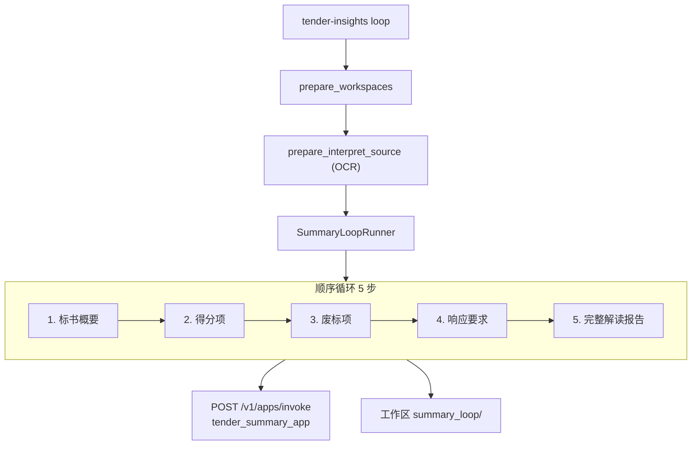

# Tender Summary Loop 设计

> 日期：2026-07-07  
> 状态：待实现  
> 范围：在 `tender_insights` 中新增 `loop` 子命令，通过顺序调用平台应用 `tender_summary_app` 完成标书解读五步法。

---

## 1. 背景与目标

### 1.1 现状

- `doc_chunk` 可将 Word/PDF 提取为 `content.md` 工作区。
- `tender_insights interpret` 采用「分段 + 多 call_type 合并」模式（`interpret_segment`、`interpret_overview` 等），产出 `interpretation.json`。
- `agent_platform` 已有 16 个独立 call_type 的 invoke 封装，默认 `PlatformBackend` 超时 **180s**，且不支持 `X-API-Key`。

### 1.2 目标

构建独立的**顺序循环模块**，作为 `tender-insights loop` 子命令：

1. 接收标书文件 + 任务背景描述（`task_background`）。
2. 调用 `doc_chunk` pipeline 提取内容，经 OCR 增强后作为 `tender_info`。
3. 按固定任务列表依次 invoke `tender_summary_app`，每步将上一步产出写入对应上下文字段。
4. 将中间结果与最终解读报告落盘到工作区 `summary_loop/`。

### 1.3 已确认决策

| 决策项 | 选择 |
|--------|------|
| 与 interpret 关系 | 新子命令，与 interpret 并行，不改动现有逻辑 |
| 智能体应用 | `tender_summary_app` 已在平台配置，**output 为纯文本** |
| `tender_info` 来源 | 复用 `prepare_interpret_source`（OCR 增强） |
| 任务定义 | 模块内硬编码 5 步；后续可据文件名/用户描述/前 1000 字动态生成 |
| 落盘 | 工作区 JSON + Markdown（中间步骤 + 最终报告） |
| 调用模式 | **仅 platform**，不走 local handler |
| API 认证 | 环境变量 `AGENT_PLATFORM_API_KEY` → `X-API-Key` 请求头 |
| 失败策略 | 非超时错误重试 1 次；**超时立即中止、不重试** |
| invoke 超时 | 默认 **600s**；若提前超时则停止并输出诊断信息 |

---

## 2. 架构

### 2.1 数据流



### 2.2 组件职责

| 组件 | 职责 |
|------|------|
| `prepare_workspaces` | 原始文件 → doc_chunk 工作区（复用现有逻辑） |
| `prepare_interpret_source` | OCR 增强 → `tender_info` 正文 |
| `SummaryLoopClient` | 专用 HTTP 客户端：API Key、600s 超时、读 `output` 文本 |
| `SummaryLoopRunner` | 维护 `LoopState`，按任务列表顺序 invoke |
| `tasks.py` | 硬编码 5 个任务的 `current_task` / `task_skills` / `output_requirement` |
| `writer.py` | 落盘 `run_state.json`、`steps/`、`results.json`、`report.md` |

### 2.3 不复用 `agent_platform.PlatformBackend` 的原因

1. 现有 `urllib.request.urlopen(..., timeout=180)` 不满足 600s 需求。
2. 需要 `X-API-Key` 请求头。
3. 本模块固定调用 `tender_summary_app` 且仅 platform 模式，独立 client 边界更清晰。

---

## 3. 状态传递

每步 invoke 的 `input` 字段：

| 字段 | 初始值 | 更新时机 |
|------|--------|----------|
| `tender_info` | OCR 增强后全文 | 全程不变 |
| `task_background` | CLI `--background` | 全程不变 |
| `tender_summary` | `""` | 步骤 1 完成后 |
| `score_points` | `""` | 步骤 2 完成后 |
| `disqualification_items` | `""` | 步骤 3 完成后 |
| `tender_responds` | `""` | 步骤 4 完成后 |
| `current_task` | 每步切换 | `tasks.py` 硬编码 |
| `task_skills` | 每步不同 | `tasks.py` 硬编码 |
| `output_requirement` | 每步不同 | `tasks.py` 硬编码 |

**平台调用约定：**

```http
POST {AGENT_PLATFORM_BASE_URL}/v1/apps/invoke
Content-Type: application/json
X-API-Key: {AGENT_PLATFORM_API_KEY}

{
  "appName": "tender_summary_app",
  "input": { ... }
}
```

**响应读取：** `status === "completed"` 时取 `output` 字符串（纯文本）；忽略 `structuredOutput`。

---

## 4. 任务列表（硬编码）

| 步骤 | `current_task` | 产出字段 | 说明 |
|------|----------------|----------|------|
| 1 | `get_tender_summary` | `tender_summary` | 标书概要 |
| 2 | `get_score_points` | `score_points` | 得分项 |
| 3 | `get_disqualification_items` | `disqualification_items` | 废标项 |
| 4 | `get_tender_responds` | `tender_responds` | 标书响应要求 |
| 5 | `generate_report` | — | 完整解读报告（写入 `report.md`） |

各步的 `task_skills`、`output_requirement` 在 `tasks.py` 中以常量定义，内容与平台 Agent prompt 对齐（实现阶段从平台配置或产品文档抄录）。

**后续扩展（非本阶段）：** 根据文件名、用户描述、正文前 1000 字摘要，调用智能体动态生成任务列表。

---

## 5. 超时与错误处理

### 5.1 环境变量

| 变量 | 默认 | 说明 |
|------|------|------|
| `AGENT_PLATFORM_BASE_URL` | `http://localhost:8000` | 平台 API 根地址（非前端 9002） |
| `AGENT_PLATFORM_API_KEY` | — | `X-API-Key`（必填） |
| `SUMMARY_LOOP_INVOKE_TIMEOUT_S` | `600` | 单次 invoke 客户端超时（秒） |

### 5.2 行为矩阵

| 场景 | 行为 |
|------|------|
| 正常完成（< 600s） | 写入该步结果，继续下一步 |
| **提前超时**（socket/HTTP timeout，且 elapsed < configured） | **立即中止，不重试**；保留已完成步骤 + 错误诊断 |
| HTTP 4xx/5xx、空 `output`、`status != completed` | 重试 1 次，仍失败则中止 |
| 循环中止 | `run_state.json` 标记 `failed`；CLI exit code 非 0 |

### 5.3 超时诊断

`summary_loop/run_state.json` 在失败时记录：

```json
{
  "status": "failed",
  "failed_step": "score_points",
  "error_type": "timeout",
  "elapsed_ms": 180003,
  "configured_timeout_s": 600,
  "message": "invoke timed out before configured limit — check client/server timeout alignment"
}
```

当 `elapsed_ms` 远小于 `configured_timeout_s * 1000`（例如约 180s）时，可判断客户端或服务端存在更短的超时配置，便于排查代码。

### 5.4 重试边界

- **超时** → 不重试（停下来排查）
- **其他可恢复错误** → 最多重试 1 次（共 2 次尝试）

---

## 6. 落盘结构

```
{workspace}/summary_loop/
├── run_state.json          # 运行状态、每步耗时、错误诊断
├── steps/
│   ├── 01_tender_summary.txt
│   ├── 02_score_points.txt
│   ├── 03_disqualification_items.txt
│   ├── 04_tender_responds.txt
│   └── 05_report.md
├── results.json            # 结构化汇总（全部字段 + task_background）
└── report.md               # 最终解读报告（步骤 5 产出）
```

`results.json` 示例结构：

```json
{
  "schema_version": "1.0",
  "task_background": "...",
  "tender_summary": "...",
  "score_points": "...",
  "disqualification_items": "...",
  "tender_responds": "...",
  "report": "...",
  "completed_steps": ["get_tender_summary", "get_score_points"],
  "status": "completed"
}
```

---

## 7. 包结构与 API

### 7.1 目录

```
src/tender_insights/summary_loop/
├── __init__.py
├── client.py          # SummaryLoopClient
├── runner.py          # SummaryLoopRunner
├── tasks.py           # TASK_DEFINITIONS
├── models.py          # LoopState, StepResult, LoopRunResult
└── writer.py          # persist_run_state, persist_step, persist_results
```

### 7.2 公共 API（供 CLI / Viewer 复用）

```python
def run_summary_loop(
    workspace: OutputWorkspace,
    *,
    task_background: str,
    client: SummaryLoopClient | None = None,
    on_progress: Callable[[str, dict], None] | None = None,
    overwrite: bool = False,
) -> LoopRunResult: ...
```

### 7.3 CLI

```bash
tender-insights loop /path/to/bid.docx \
  -o ./output/my-bid \
  --background "本次投标重点关注价格分和技术方案" \
  [--overwrite] \
  [--timeout 600]
```

| 参数 | 说明 |
|------|------|
| `paths` | 标书文件或已有工作区（复用 `prepare_workspaces`） |
| `-o / --output` | 工作区目录（原始文件时必填） |
| `--background` | `task_background`（必填） |
| `--overwrite` | 覆盖已有 `summary_loop/` |
| `--timeout` | 覆盖 `SUMMARY_LOOP_INVOKE_TIMEOUT_S` |

---

## 8. 测试策略

| 层级 | 内容 | 依赖 |
|------|------|------|
| 单元 | `SummaryLoopRunner` 状态传递、字段累积 | mock client |
| 单元 | 超时错误分类（timeout 不重试 vs 其他重试 1 次） | mock client |
| 单元 | `writer` 落盘结构与 `run_state.json` 诊断字段 | 无网络 |
| 单元 | `SummaryLoopClient` HTTP mock（API Key 头、超时参数） | 无网络 |
| 集成（可选） | 真实平台 + 短标书样例 | 需平台运行与 API Key |

---

## 9. 非目标

- 不修改现有 `interpret` 流水线与 `interpretation.json` schema
- 不新增 `tender_summary_app` 的 local handler
- 不修改 `agent_platform.PlatformBackend` 的全局 180s 超时
- 不在本阶段实现动态任务列表生成
- 不在本阶段 provision `tender_summary_app`（假定平台已配置）

---

## 10. 验收标准

- [ ] `tender-insights loop <docx> -o <dir> --background "..."` 端到端跑通 5 步
- [ ] `tender_info` 使用 OCR 增强后的正文
- [ ] 每步中间结果与 `results.json`、`report.md` 正确落盘
- [ ] 客户端超时默认 600s，可通过 `--timeout` / 环境变量覆盖
- [ ] 提前超时：立即中止、不重试、`run_state.json` 含 `elapsed_ms` 与 `configured_timeout_s`
- [ ] 非超时失败：重试 1 次后中止，保留 partial 结果
- [ ] 请求携带 `X-API-Key`（来自 `AGENT_PLATFORM_API_KEY`）
