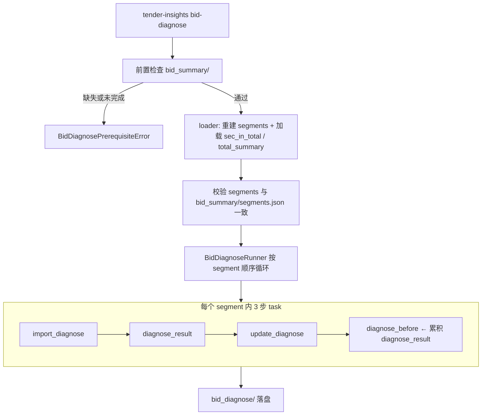

# Bid Diagnose 设计

> 日期：2026-07-08  
> 状态：待实现  
> 范围：在 `tender_insights` 中新增 `bid-diagnose` 子命令，按 bid-summary 分段计划顺序调用平台应用 `bid_diagnose_app`，对每个分片执行三步诊断任务，产出滚动累积的标书诊断结果。

---

## 1. 背景与目标

### 1.1 现状

- `doc-chunk pipeline` 可将招标文件提取为工作区（`content.md` + `chunks/`）。
- `tender-insights loop` 通过 `tender_summary_app` 顺序解读全文，产出 `summary_loop/report.md`。
- `tender-insights bid-summary` 通过 `bid_chunk_summary` 对优化分段滚动概要，产出 `bid_summary/`（含 `segments.json`、`sec_in_total.json`、`total_summary.md`）。
- 尚无模块在「解读概要 + 分片正文 + 段内定位」上下文下，按分片逐步生成诊断重点、段级诊断结果与滚动累积诊断。

### 1.2 目标

构建独立的 **bid_diagnose** 模块，作为 `tender-insights bid-diagnose` 子命令：

1. 严格依赖已有 `bid_summary/` 产物（分段计划、sec_in_total、total_summary）。
2. 复用 bid-summary 分段边界：读取 `bid_summary/segments.json`，本地重建 segment markdown 并校验一致。
3. 对每个 segment 顺序 invoke `bid_diagnose_app` 三步任务：`import_diagnose` → `diagnose_result` → `update_diagnose`。
4. 滚动传递 `diagnose_before`（上一段 `update_diagnose` 产出的累积 `diagnose_result`）。
5. 落盘到 `bid_diagnose/`。

### 1.3 已确认决策

| 决策项 | 选择 |
|--------|------|
| 前置流水线 | `doc-chunk` → `loop` → `bid-summary` → **`bid-diagnose`** |
| `bid_background` | CLI/API 参数 `--background` 传入，可为空 |
| `analysis_report` | `bid_summary/total_summary.md` |
| `sec_in_total` | `bid_summary/sec_in_total.json` 中当前 segment 对应条目 |
| 分段计划 | **直接对齐** `bid_summary/segments.json`（段数、char_count、source_chunk_ids） |
| segment markdown | 本地复跑 `optimize_segments()` 重建，与 segments.json 校验一致 |
| 每 segment 任务 | `import_diagnose` → `diagnose_result` → `update_diagnose`，各 1 次 invoke |
| `task_skills` / `output_requirement` | `tasks.py` 硬编码（镜像 `summary_loop`）；`import_diagnose` 复用 loop 诊断 prompt |
| 子包 / CLI / 输出目录 | `bid_diagnose/` / `bid-diagnose` / `{workspace}/bid_diagnose/` |
| 平台应用 | `bid_diagnose_app`，**structuredOutput** 为 JSON |
| 调用模式 | **仅 platform**，专用 client，不走 `PlatformBackend` |
| 失败策略 | 与 bid-summary 一致：非超时重试 1 次；**超时立即中止、不重试** |
| invoke 超时 | 默认 **600s**，环境变量 `BID_DIAGNOSE_INVOKE_TIMEOUT_S` |

---

## 2. 架构

### 2.1 数据流



### 2.2 滚动状态

| 状态字段 | 作用域 | 说明 |
|----------|--------|------|
| `diagnose_before` | 跨 segment | 累积诊断；首段 `""`；每段 `update_diagnose` 后更新 |
| `import_diagnose` | 段内 | step1 产出，供 step2 使用；段结束后丢弃 |
| `diagnose_result`（段级） | 段内 | step2 产出本段诊断；段结束后丢弃 |
| `analysis_report` | 全程不变 | `bid_summary/total_summary.md` |
| `bid_background` | 全程不变 | CLI `--background` |

### 2.3 组件职责

| 组件 | 职责 |
|------|------|
| `loader.py` | 校验 `bid_summary/` 产物；重建 segment markdown；加载 sec_in_total 映射 |
| `tasks.py` | 3 个 `TaskDefinition`（`current_task` / `task_skills` / `output_requirement` / `output_field`） |
| `BidDiagnoseClient` | 专用 HTTP 客户端：API Key、600s 超时、读 `structuredOutput` JSON |
| `BidDiagnoseRunner` | 外层 segment 循环 + 内层 task 顺序 invoke + 重试/超时 |
| `writer.py` | 落盘 `bid_diagnose/` |
| `common/diagnosis_prompts.py` | 从 `summary_loop/tasks.py` 提取共享 `_DIAGNOSIS_SKILLS` / `_DIAGNOSIS_CHECKLIST` |

### 2.4 只读共享依赖

- `diagnosis/segment_optimizer.optimize_segments()` — 重建 segment markdown
- `diagnosis/models.DiagnosisSegment` — segment 数据结构

**不修改**现有 `diagnosis/`（bid-summary）包行为。

### 2.5 不复用 `PlatformBackend` 的原因

与 bid-summary / summary_loop 一致：

1. 默认超时 180s 不满足 600s。
2. 需要 `X-API-Key`。
3. 本模块读 **structuredOutput**（JSON），专用 client 边界更清晰。

---

## 3. 前置条件与 Loader

### 3.1 必须存在的文件

| 路径 | 用途 |
|------|------|
| `bid_summary/segments.json` | 分段计划 |
| `bid_summary/sec_in_total.json` | 每段 `sec_in_total` |
| `bid_summary/total_summary.md` | `analysis_report` |
| `bid_summary/run_state.json` | 校验 bid-summary 已完成（`status == "completed"`） |
| `chunks/index.json` + chunk 文件 | 重建 segment markdown |

### 3.2 Loader 流程

1. 逐项校验上述路径；缺失则 `BidDiagnosePrerequisiteError` + 中文提示（指向 `tender-insights bid-summary`）。
2. 读取 `bid_summary/run_state.json`；若 `status != "completed"` 则报错。
3. 读取 `chunks/` → `optimize_segments()` 得到 `list[DiagnosisSegment]`。
4. 读取 `bid_summary/segments.json`，逐段校验：
   - `segment_index` 一致
   - `char_count` 一致
   - `source_chunk_ids` 一致（顺序敏感）
5. 校验失败 → `BidDiagnosePrerequisiteError`：「分段计划与 bid-summary 不一致，请重跑 bid-summary」。
6. 读取 `sec_in_total.json` → `dict[int, str]`（segment_index → sec_in_total）。
7. 读取 `total_summary.md` → `analysis_report`。

### 3.3 前置缺失错误

| 缺失 | 错误类型 | 提示 |
|------|----------|------|
| `bid_summary/` 或关键文件 | `BidDiagnosePrerequisiteError` | 请先运行 `tender-insights bid-summary ...` |
| bid-summary 未完成 | `BidDiagnosePrerequisiteError` | bid-summary 状态非 completed |
| segments 校验不一致 | `BidDiagnosePrerequisiteError` | 请重跑 bid-summary |
| `chunks/` | `BidDiagnosePrerequisiteError` | 请先运行 `doc-chunk pipeline ...` |

---

## 4. Invoke 契约

### 4.1 平台调用

```http
POST {AGENT_PLATFORM_BASE_URL}/v1/apps/invoke
Content-Type: application/json
X-API-Key: {AGENT_PLATFORM_API_KEY}

{
  "appName": "bid_diagnose_app",
  "input": {
    "bid_background": "",
    "analysis_report": "...",
    "diagnose_before": "",
    "sec_in_total": "...",
    "current_chunk": "...",
    "import_diagnose": "",
    "diagnose_result": "",
    "current_task": "import_diagnose",
    "task_skills": "...",
    "output_requirement": "..."
  }
}
```

所有 input 字段均为**字符串**；尚未产出的字段传 `""`。

### 4.2 输入字段

| 字段 | 说明 |
|------|------|
| `bid_background` | CLI `--background`，可为空 |
| `analysis_report` | `bid_summary/total_summary.md` 全文，全程不变 |
| `diagnose_before` | 上一段 `update_diagnose` 的累积 `diagnose_result`；第 1 段为 `""` |
| `sec_in_total` | 当前 segment 在 `sec_in_total.json` 中的值 |
| `current_chunk` | 当前 segment 正文（`DiagnosisSegment.markdown`） |
| `import_diagnose` | step1 完成后填入；step1 前为 `""` |
| `diagnose_result` | step2 完成后填入本段结果；step3 输入为本段结果；step3 前 step2 未产出则为 `""` |
| `current_task` | `import_diagnose` \| `diagnose_result` \| `update_diagnose` |
| `task_skills` | 来自 `tasks.py`，每步不同 |
| `output_requirement` | 来自 `tasks.py`，每步不同 |

### 4.3 输出（structuredOutput）

| `current_task` | structuredOutput | 写入 state |
|----------------|------------------|------------|
| `import_diagnose` | `{ "import_diagnose": "..." }` | `segment_state.import_diagnose` |
| `diagnose_result` | `{ "diagnose_result": "..." }` | `segment_state.segment_diagnose_result` |
| `update_diagnose` | `{ "diagnose_result": "..." }` | `state.diagnose_before`（累积，供下段） |

**响应读取：** `status === "completed"` 时取 `structuredOutput`，校验对应 output 字段为非空字符串；缺失或为空则 `BidDiagnoseInvokeError`。

---

## 5. Task 定义

### 5.1 模型

```python
@dataclass(frozen=True)
class TaskDefinition:
    step_index: int
    current_task: str
    task_skills: str
    output_requirement: str
    output_field: str
```

### 5.2 三步任务

| step | `current_task` | `output_field` | prompt 来源 |
|------|----------------|----------------|-------------|
| 1 | `import_diagnose` | `import_diagnose` | 共享 `diagnosis_prompts.py`（原 loop `diagnosis_criteria` 的 skills + checklist） |
| 2 | `diagnose_result` | `diagnose_result` | 针对当前分片正文，结合诊断重点产出本段诊断结果（实现阶段与平台 prompt 对齐） |
| 3 | `update_diagnose` | `diagnose_result` | 将本段诊断合并进累积诊断（实现阶段与平台 prompt 对齐） |

### 5.3 共享 prompt 提取

将 `summary_loop/tasks.py` 中的 `_DIAGNOSIS_SKILLS`、`_DIAGNOSIS_CHECKLIST` 提取到 `tender_insights/common/diagnosis_prompts.py`，供 loop 与 bid_diagnose 共用，避免重复维护。

---

## 6. Runner 逻辑

### 6.1 伪代码

```python
state = BidDiagnoseState(
    bid_background=bid_background,
    analysis_report=analysis_report,
    diagnose_before="",
    segments=segments,
)

for segment in state.segments:
    segment_state = SegmentDiagnoseState()
    sec_in_total = sec_map[segment.segment_index]

    for task in TASK_DEFINITIONS:
        invoke_input = state.to_invoke_input(segment, task, segment_state, sec_in_total)
        result = client.invoke(invoke_input)
        state.apply_output(task, result.output, segment_state)
        write_step_progress(...)

    write_segment_result(bid_diagnose_dir, segment, segment_state, ...)
    # segment_state 丢弃；state.diagnose_before 已在 update_diagnose 后更新

write_diagnose_result_md(bid_diagnose_dir, state.diagnose_before)
```

### 6.2 进度回调

```python
on_progress("bid_diagnose", {
    "message": "标书诊断 分段 2/5 · diagnose_result",
    "segment": 2,
    "total_segments": 5,
    "task": "diagnose_result",
})
```

### 6.3 失败策略

| 场景 | 行为 |
|------|------|
| 正常完成 | 写入该步结果，继续 |
| **超时** | **立即中止，不重试**；保留已完成 segment + 错误诊断 |
| HTTP 4xx/5xx、无效 structuredOutput、`status != completed` | 重试 1 次，仍失败则中止 |
| 循环中止 | `run_state.json` 标记 `failed` 或 `partial`；CLI exit code 非 0 |

记录 `failed_segment` 与 `failed_task`（如 `"2/import_diagnose"` 或分字段存储）。

---

## 7. 落盘结构

```
{workspace}/bid_diagnose/
├── run_state.json
├── diagnose_result.md          # 最终累积诊断（最后一段 update_diagnose 产出）
└── segments/
    ├── 001_diagnose.json
    ├── 002_diagnose.json
    └── ...
```

### 7.1 `segments/001_diagnose.json`

```json
{
  "schema_version": "1.0",
  "segment_index": 1,
  "char_count": 9200,
  "source_chunk_ids": ["chunk_003"],
  "sec_in_total": "...",
  "import_diagnose": "...",
  "segment_diagnose_result": "...",
  "steps": [
    {"current_task": "import_diagnose", "duration_ms": 12000, "attempt": 1},
    {"current_task": "diagnose_result", "duration_ms": 15000, "attempt": 1},
    {"current_task": "update_diagnose", "duration_ms": 8000, "attempt": 1}
  ]
}
```

### 7.2 `run_state.json`

与 `bid_summary/run_state.json` 结构对齐，扩展字段：

- `status`: `completed` \| `failed` \| `partial`
- `completed_segments`: `[1, 2, ...]`
- `failed_segment`: 失败 segment index（可选）
- `failed_task`: 失败 task 名（可选）
- `error_type`, `message`, `elapsed_ms`, `configured_timeout_s`

---

## 8. 包结构与 API

### 8.1 目录

```
src/tender_insights/bid_diagnose/
├── __init__.py
├── models.py
├── tasks.py
├── loader.py
├── client.py
├── runner.py
└── writer.py

src/tender_insights/common/
└── diagnosis_prompts.py       # 新增，从 summary_loop 提取
```

### 8.2 公共 API

```python
def run_bid_diagnose(
    workspace: OutputWorkspace,
    *,
    bid_background: str = "",
    client: BidDiagnoseClient | None = None,
    on_progress: Callable[[str, dict], None] | None = None,
    overwrite: bool = False,
    timeout_s: int | None = None,
) -> BidDiagnoseRunResult: ...
```

`tender_insights/api.py` 门面：

```python
def run_bid_diagnose_job(
    workspace: OutputWorkspace,
    *,
    bid_background: str = "",
    on_progress: Callable[[str, dict], None] | None = None,
    overwrite: bool = False,
    timeout_s: int | None = None,
) -> BidDiagnoseRunResult: ...
```

### 8.3 CLI

```bash
# 前置：doc-chunk + loop + bid-summary 已完成
tender-insights bid-diagnose ./output/my-bid \
  [--background "本次投标关注价格分"] \
  [--overwrite] \
  [--timeout 600]
```

| 参数 | 说明 |
|------|------|
| `path` | 已有工作区目录 |
| `--background` | `bid_background`，默认空 |
| `--overwrite` | 覆盖已有 `bid_diagnose/` |
| `--timeout` | 覆盖 `BID_DIAGNOSE_INVOKE_TIMEOUT_S` |

**典型完整流程：**

```bash
doc-chunk pipeline /path/to/tender.docx -o ./output/my-bid --overwrite
tender-insights loop ./output/my-bid --background "..."
tender-insights bid-summary ./output/my-bid --overwrite
tender-insights bid-diagnose ./output/my-bid --background "..." --overwrite
```

### 8.4 环境变量

| 变量 | 默认 | 说明 |
|------|------|------|
| `AGENT_PLATFORM_BASE_URL` | `http://localhost:8000` | 平台 API 根地址 |
| `AGENT_PLATFORM_API_KEY` | — | `X-API-Key`（必填） |
| `BID_DIAGNOSE_INVOKE_TIMEOUT_S` | `600` | 单次 invoke 客户端超时（秒） |

---

## 9. 测试策略

| 层级 | 内容 | 依赖 |
|------|------|------|
| 单元 | `loader`：缺 bid_summary 报错；segments 校验通过/失败；sec_in_total 映射 | 无网络 |
| 单元 | `BidDiagnoseClient`：HTTP mock；三步 structuredOutput 解析；空字段报错 | 无网络 |
| 单元 | `BidDiagnoseRunner`：`diagnose_before` 滚动；段内三步顺序；重试；超时中止 | mock client |
| 单元 | `writer`：落盘结构；partial 保留 | 无网络 |
| 单元 | `tasks`：三步 TaskDefinition 完整性 | 无网络 |
| 单元 | CLI `--help`、`--background` 传参 | 无网络 |

---

## 10. 非目标

- 不自动运行 `doc-chunk`、`loop` 或 `bid-summary`
- 不修改 `diagnosis/`（bid-summary）现有行为
- 不修改 `doc_chunk` 分块逻辑
- 不在本阶段新增 `bid_diagnose_app` 的 local handler（假定平台已配置）
- 不在本阶段 provision `bid_diagnose_app`（假定平台已配置）
- 不支持独立重新分段（必须对齐 bid-summary）

---

## 11. 验收标准

- [ ] `tender-insights bid-diagnose <workspace>` 在前置齐全时端到端跑通
- [ ] 缺 `bid_summary/` 或 bid-summary 未完成时报错并给出正确 CLI 提示
- [ ] segments 重建结果与 `bid_summary/segments.json` 校验一致
- [ ] 每 segment 按 `import_diagnose` → `diagnose_result` → `update_diagnose` 顺序 invoke
- [ ] `diagnose_before` 正确滚动传递累积诊断
- [ ] `bid_diagnose/segments/`、`diagnose_result.md`、`run_state.json` 正确落盘
- [ ] 客户端超时默认 600s；提前超时不重试；非超时失败重试 1 次
- [ ] 请求携带 `X-API-Key`（来自 `AGENT_PLATFORM_API_KEY`）
- [ ] `--background` 正确传入 `bid_background`，默认空字符串
